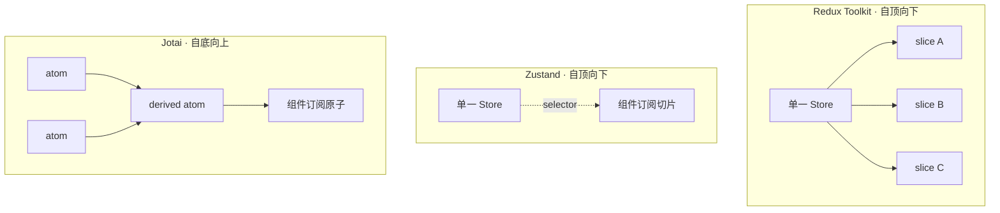
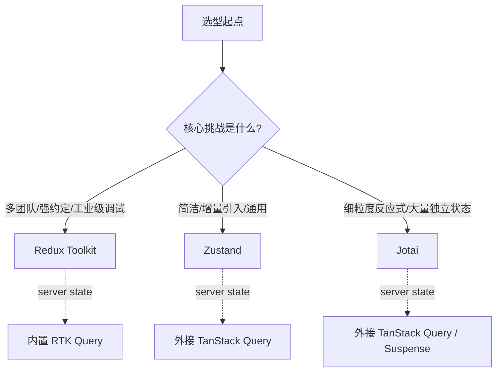

# 状态管理选型 · 架构维度调研（Zustand / Redux Toolkit / Jotai）

> 调研人：架构师（architect）
> 时间：2026-06
> 视角：从**扩展性、维护性、生态成熟度**三个架构维度，对比三方案在大规模（50+ 模块）、多团队并行开发场景下的表现，并给出各自的适用边界。所有结论附数据来源。
> 数据校验：包体积、npm 下载量、版本号、Recoil 归档状态均已用一手来源(Bundlephobia API / npm registry API / 官方仓库)实测核对，未沿用二手概数；标注"第三方估算"的数字不作为事实陈述。

---

## 0. 三种范式的本质差异

三个库解决的是同一个问题，但底层心智模型完全不同，这是后续所有架构差异的根源：

| 维度 | Redux Toolkit | Zustand | Jotai |
|------|--------------|---------|-------|
| 状态模型 | 中心化单一 store + reducer（Flux/自顶向下） | 单一 hook-based store（自顶向下） | 组合式原子 atom（自底向上） |
| 状态存放位置 | React 外部 store | React 外部 store | 优先 Context、其次 module（贴近组件树） |
| 重渲染粒度 | selector 级 | subscription 级 | atom 级（最细） |
| Provider | 需要 | 不需要 | 可选（用于 scope 隔离） |
| 样板代码 | 中（RTK 已大幅削减） | 极低 | 极低 |
| 包体积（min+gzip） | 13.27KB | 0.47KB | 3.85KB |

> 包体积为实测数据，来源 [Bundlephobia API](https://bundlephobia.com/)，对应版本：`@reduxjs/toolkit@2.12.0`、`zustand@5.0.14`、`jotai@2.20.0`（实测时间 2026-06，npm latest）。需注意三点：(1) RTK 的 13.27KB 是 `@reduxjs/toolkit` 主包，**不含 RTK Query**（`@reduxjs/toolkit/query` 需另算），实际接入 server state 后体积更大；(2) Zustand 的 0.47KB 是 `zustand` 核心入口，接入 `persist`/`immer`/`devtools` 中间件会增加；(3) Jotai 的 3.85KB 已比早期文章常引用的"~2KB"高，原子工具集（`jotai/utils`、`jotai-tanstack-query`）按需引入还会叠加。换言之，这些数字是"起步体积"而非"生产体积"，但量级关系（Zustand ≪ Jotai < RTK）稳定成立。

官方自己的定位也印证了这种分野：Jotai 文档把关系概括为"Jotai is like Recoil, Zustand is like Redux"——Zustand 是单一 store(top-down)，Jotai 是原子组合(bottom-up)（来源：[Jotai 官方 Comparison](https://jotai.org/docs/basics/comparison)）。pmndrs 维护者 Daishi Kato 的原话是"Jotai state consists of atoms (bottom-up); Zustand state is one object (top-down)"（来源：[pmndrs/jotai #13](https://github.com/pmndrs/jotai/issues/13)）。

### 采用率（实测 npm 周下载量）

采用率是评估生态成熟度与"踩坑后能否搜到解法"的硬指标。以下为实测数据（来源：[npm registry downloads API](https://api.npmjs.org/downloads/point/last-week/)，实测时间 2026-06，单位：次/周）：

| 包 | 周下载量 | 说明 |
|---|---|---|
| `zustand` | ~3898 万 | 三个 client-state 库中下载量最高 |
| `redux` | ~3343 万 | Redux 核心,多数经 RTK 间接引入 |
| `react-redux` | ~2712 万 | React 绑定层 |
| `@reduxjs/toolkit` | ~2059 万 | 官方推荐入口 |
| `jotai` | ~486 万 | 三者中最低,但绝对量已属一线 |
| `@tanstack/react-query` | ~5463 万 | 作为对照:server state 方案的下载量高于任一 client-state 库,印证下文"server/client 分离"的主流地位 |

需要说明两点:Zustand 单包下载量已超过 RTK,但 Redux 生态是 `redux + react-redux + @reduxjs/toolkit` 三包叠加,真实占用面更广,不能只看单包。Jotai 下载量约为 Zustand 的 1/8,这是它"约定缺失需团队自带纪律"在生态侧的体现——可参考的大型实践与现成方案相对少。TanStack Query 下载量高于所有 client-state 库,直接佐证了"70% 的状态问题其实是数据获取问题"这一判断。

---

## 1. 扩展性（50+ 模块、多团队并行）

### 1.1 Redux Toolkit：约束最强，原生支持动态注入

在 50+ 模块、多团队并行场景下，RTK 是结论最一致被推荐的方案——原因不是它简单，而是它的**强约束 + 成熟的动态注入机制**最能抵抗大型 codebase 的结构退化。

RTK 2.0 引入的 `combineSlices` 是为代码分割与多团队设计的核心能力：它"combines slices into a single reducer, and enables injection of more reducers after initialisation"，配套 `inject()`、`withLazyLoadedSlices()`、`selector()` 三个方法（来源：[Redux Toolkit · combineSlices API](https://redux-toolkit.js.org/api/combineSlices)）：

- `inject()`：store 初始化后**懒加载**注入 slice reducer，按需挂载（路由/模块加载时）。
- `withLazyLoadedSlices()`：解决懒加载 slice 的 TypeScript 推断缺口——在创建 store 时声明"将来会注入的 slice"，配合 module augmentation 让类型可见，**无需把懒加载 slice 提前 import 进主 reducer 文件**。这一点对多团队并行很关键：团队 A 不必为了类型正确而依赖团队 B 的模块。
- `selector()`：用 Proxy 包裹 state，保证尚未 dispatch 的注入 slice 也能取到 initial state，避免选择器里到处写可选判断。

这套机制天然适配"每个团队管理自己的 slice"的微前端/插件式架构（来源：[Dynamic Slice Injection in Redux Toolkit for Micro-Frontend Architectures](https://dev.to/hexshift/dynamic-slice-injection-in-redux-toolkit-for-micro-frontend-architectures-53bh)；[Redux 官方 Code Splitting 文档](https://redux.js.org/usage/code-splitting)）。RTK Query 侧也有平行机制 `injectEndpoints`，从一个空的中心 API slice 出发按需注入端点（来源：[RTK Query Code Splitting](https://redux-toolkit.js.org/rtk-query/usage/code-splitting)）。

业界共识：对真正大规模、多团队、状态高度相互依赖的企业应用，RTK 仍是最稳妥的架构选择，正是因为它的严格性（来源：[Better Stack · Zustand vs RTK vs Jotai](https://betterstack.com/community/guides/scaling-nodejs/zustand-vs-redux-toolkit-vs-jotai/)）。

### 1.2 Zustand：增量采用最友好，但 store 结构退化风险靠团队自律

Zustand 的 hook-based API 不需要 Provider 包裹整个应用，可以在任意组件直接拿到所需状态切片，因此**增量引入到既有项目**的成本最低（来源：[Better Stack](https://betterstack.com/community/guides/scaling-nodejs/zustand-vs-redux-toolkit-vs-jotai/)）。它支持把 store 拆成 slice 模式来组织大型状态。

但 Zustand 不强制任何结构约定。在 50+ 模块场景下，store 容易退化为一个巨大的扁平对象——这个风险不来自库本身，而来自缺乏约束。它的官方定位偏"versatile middle ground"：适合大多数项目，但当团队数量增多、调试变痛苦时，社区给出的演进路径恰恰是**迁移到 RTK 换取结构**（来源：[Medium · Pooja Gandhakwala, State Management in 2025](https://medium.com/@pooja.1502/state-management-in-2025-redux-toolkit-vs-zustand-vs-jotai-vs-tanstack-store-c888e7e6f784)）。

### 1.3 Jotai：原子解耦利于并行，但无约定易生隐式耦合

Jotai 的原子模型在扩展性上有独特优势：原子之间**根本上解耦**，每个 feature 只 import 自己需要的原子，因此非常适合微前端架构；可以按实体/领域组织成百上千个原子，只有依赖该原子的组件才重渲染，UI 层高度可扩展（来源：[React News · Scalable State Management with Jotai](https://react-news.com/scalable-state-management-a-deep-dive-into-jotai-for-modern-react-applications)）。官方也强调 Jotai"scales from a simple useState replacement to an enterprise TypeScript application"，且在"code splitting important"时优先推荐 Jotai（来源：[Jotai 官网](https://jotai.org/)、[Comparison](https://jotai.org/docs/basics/comparison)）。

代价同样明确：Jotai **没有像 Redux 那样的 reducer/selector/action 约定**，状态组织规范完全交给团队。当团队规模扩大，原子状态仍可能退化为隐式耦合——除非 codebase 有清晰边界（如 Feature-Sliced Design）。最典型的反模式是"God Atom"（把无关状态塞进一个大对象原子），会重蹈大型 Redux store 的覆辙；正确做法是拆成最小粒度原子，按模块分组（来源：[Feature-Sliced Design · Jotai 文章](https://feature-sliced.design/blog/jotai-minimalist-architecture)；[StudyRaid · Structuring atoms in large applications](https://app.studyraid.com/en/read/11290/352229/structuring-atoms-in-large-applications)）。

`Provider` 提供 scope 能力，对组件库/monorepo 中同一 widget 多实例需要各自独立状态的场景至关重要，也利于隔离测试（来源：[React News](https://react-news.com/scalable-state-management-a-deep-dive-into-jotai-for-modern-react-applications)）。

### 扩展性小结

| | 动态/懒加载注入 | 多团队边界约束 | 增量引入成本 | 结构退化风险 |
|---|---|---|---|---|
| RTK | 原生（combineSlices/inject） | 强（约定 + 类型隔离） | 中 | 低（约束兜底） |
| Zustand | 需手写 slice 模式 | 弱（靠自律） | 最低 | 中高（扁平 store） |
| Jotai | 原子天然解耦 | 弱（无约定，需 FSD 等方法论） | 低 | 中（God Atom） |

---

## 2. 维护性（可预测性、可追溯、单向数据流、规模化可读性）

### 2.1 状态变化的可预测性与单向数据流

RTK 沿用 Flux 单向数据流：action 描述事件、reducer 计算新状态，状态变更路径强约束、可预测。这正是它"适合大型企业应用、强调可预测性与团队约定"的核心原因（来源：[Better Stack](https://betterstack.com/community/guides/scaling-nodejs/zustand-vs-redux-toolkit-vs-jotai/)）。

Zustand 没有正式的"action"概念，状态直接通过 set 更新——简洁，但也意味着缺少一层显式的变更语义。Jotai 通过 derived atom 链式组合来表达派生逻辑，往往比大型 reducer 更易维护，但同样不强制单向流约定。

### 2.2 调试可追溯性（这是维护性上三者差距最大的一项）

调试工具的**深度**直接决定大型应用的可追溯性：

- **RTK**：Redux DevTools 是调试利器，提供完整的 time-travel、action 逐条回放、详细状态检查——这是三者中最完整的（来源：[Markaicode · Zustand vs RTK 2025](https://markaicode.com/react-19-zustand-vs-redux-toolkit-guide/)）。
- **Zustand**：通过 `devtools` 中间件接入 Redux DevTools，可得到状态历史和带标签的更新，但**拿不到完整的 action 逐条回退/重放**，因为它没有正式的 action 概念。需注意给 action 命名（`set` 第三参数），否则显示为 anonymous（来源：[Zustand devtools 官方文档](https://zustand.docs.pmnd.rs/reference/middlewares/devtools)；[DeepWiki · Zustand devtools](https://deepwiki.com/pmndrs/zustand/3.2-devtools-middleware)）。
- **Jotai**：两条路径——`useAtomsDebugValue`（React DevTools，读值为主）和 `jotai-devtools` 的 `useAtomDevtools`/`useAtomsDevtools`（桥接 Redux DevTools，支持 time-travel、Jump、Dispatch、暂停录制）。但需注意 `snapshotHistoryLimit` 默认 Infinity 会持续吃内存，推荐设为 ~30（来源：[Jotai 官方 Devtools 文档](https://jotai.org/docs/tools/devtools)；[jotaijs/jotai-devtools](https://github.com/jotaijs/jotai-devtools)）。

结论：需要工业级调试追溯能力时，RTK 仍是最佳；Jotai/Zustand 是更轻量的集成，覆盖大多数应用但深度不及（来源：[tech-insider · Zustand vs Redux 2026](https://tech-insider.org/zustand-vs-redux-2026/)）。

### 2.3 规模增长下的代码可读性

RTK 的代价是样板代码——即便有 createSlice，仍比 Zustand/Jotai 多一层设置；异步处理需额外中间件（thunk/saga）；若 selector 优化不当会有性能瓶颈（来源：[Better Stack](https://betterstack.com/community/guides/scaling-nodejs/zustand-vs-redux-toolkit-vs-jotai/)）。Zustand/Jotai 样板极少，但把"可读性靠约定"的责任压给了团队。

### 维护性小结

可预测性与可追溯性 RTK 最强（单向流 + 完整 time-travel），代价是样板与一定学习曲线；Zustand 可读性最好但调试深度有限、缺显式变更语义；Jotai 派生原子表达力强、调试工具齐全，但缺统一约定，规模化可读性依赖团队架构纪律。

---

## 3. 生态成熟度（中间件、Server State 集成、维护方与归档风险）

### 3.1 关键架构前提：Server State 与 Client State 必须分离

2025 的主流共识是分层架构——**不要用 Redux/Zustand/Jotai 管 server state**，server state 用 TanStack Query 或 RTK Query。经验法则：先分类，往往会发现"状态管理问题"里 70% 其实是数据获取问题（来源：[Bugra Gulculer · React Query and Zustand rewired state management](https://www.bugragulculer.com/blog/good-bye-redux-how-react-query-and-zustand-re-wired-state-management-in-25)；[Better Stack](https://betterstack.com/community/guides/scaling-nodejs/zustand-vs-redux-toolkit-vs-jotai/)）。这直接影响选型——任何一个 client-state 库的"中间件成熟度"都要和它的 server-state 搭配方案一起评估。

### 3.2 中间件与 Server State 集成对比

| | persist/immer | Server State 方案 | Suspense |
|---|---|---|---|
| RTK | Redux-Persist + 内置 Immer；thunk/saga 处理副作用 | **内置 RTK Query**（生态最一体化，官方定位为"eliminating the need to hand-write data fetching & caching logic yourself"） | 需手动处理 |
| Zustand | `persist` + `immer` 中间件（`persist(immer(...))`） | **无内置异步**，需搭配 TanStack Query | 需手动 |
| Jotai | `atomWithStorage` | `atomWithQuery`（`jotai-tanstack-query`），query key 可由其他 atom 派生 | **原生集成 Suspense** |

来源：[RTK Query Overview（官方）](https://redux-toolkit.js.org/rtk-query/overview)；[Better Stack](https://betterstack.com/community/guides/scaling-nodejs/zustand-vs-redux-toolkit-vs-jotai/)；[Medium · State Management in 2025](https://medium.com/@pooja.1502/state-management-in-2025-redux-toolkit-vs-zustand-vs-jotai-vs-tanstack-store-c888e7e6f784)。

要点：RTK 的 server state 集成最"开箱即用"（RTK Query 与 store 同一体系，已有 Redux 的项目零额外心智成本）；Zustand 必须外接 TanStack Query；Jotai 既能外接 TanStack Query，又在 Suspense 上有原生优势，适合编辑器/表单这类需要细粒度异步派生的场景。

需要校正一个常见数字：部分二手文章称 RTK Query"替代 60-80% 的 Redux server 代码"，但 Redux 官方文档并未给出这一比例,只表述为"消除手写数据获取与缓存逻辑的需要"并指出此前用户"仍需写大量 reducer 逻辑来管理加载状态和缓存数据"。这里采用官方口径，把"60-80%"作为第三方估算而非事实陈述。

### 3.3 维护方与归档风险

| | 维护方 | 治理 | 归档风险 |
|---|---|---|---|
| RTK | 官方 **Redux team**（`reduxjs` 组织），是官方推荐的标准写法 | 活跃；近期因 npm 供应链攻击切换到 Trusted Publishing 并做了 CI 硬化 | 低 |
| Zustand | **pmndrs** 集体（核心维护者 Daishi Kato） | 活跃 | 低 |
| Jotai | **pmndrs** 集体（同核心维护者 Daishi Kato） | 活跃 | 低 |

来源：[Redux Toolkit 官网](https://redux-toolkit.js.org/)；[reduxjs/redux-toolkit Releases](https://github.com/reduxjs/redux-toolkit/releases)；[pmndrs/zustand Discussion #1033](https://github.com/pmndrs/zustand/discussions/1033)；[pmndrs/jotai #13](https://github.com/pmndrs/jotai/issues/13)。

三者维护方都明确、活跃，**归档风险都低**。差异在治理模式：RTK 由 Redux 官方团队背书、定位"标准写法"，机构属性更强；Zustand/Jotai 同属 pmndrs 集体、共享核心维护者，走"多个小而专的库各司其职"的路线。

这里有一个对原子方案选型至关重要的反例：**Recoil（Jotai 的原型参照）已被 Meta 于 2025-01-01 正式归档（archived），仓库转为只读、不再维护，且与 React 19 不兼容**（它依赖了 React 从未公开的内部 API，React 改动后即失效）（来源：[facebookexperimental/Recoil GitHub](https://github.com/facebookexperimental/Recoil)；[Recoil Discussion #2171](https://github.com/facebookexperimental/Recoil/discussions/2171)）。Recoil 的归档恰恰说明:同样的原子心智模型,选 Jotai 而非 Recoil 才是当前稳妥选择——Jotai 由 pmndrs 活跃维护、兼容 React 19,是 Recoil 事实上的接棒者。这也是"归档风险"这一维度不能只看当下、要看治理可持续性的现实理由。

一个值得关注但尚不成熟的新选项是 TanStack Store（signal-based），社区支持仍弱，暂不建议生产选型（来源：[Medium · State Management in 2025](https://medium.com/@pooja.1502/state-management-in-2025-redux-toolkit-vs-zustand-vs-jotai-vs-tanstack-store-c888e7e6f784)）。

---

## 4. 三方案适用场景边界

**Redux Toolkit 的边界**：适合大规模、多团队、状态高度相互依赖、需要严格约定与完整 time-travel 调试的企业应用；offline-first、跨数十个实体的乐观更新、复杂中间件管线也属其强项。代价是样板与学习曲线，小项目用它偏重（来源：[Better Stack](https://betterstack.com/community/guides/scaling-nodejs/zustand-vs-redux-toolkit-vs-jotai/)）。

**Zustand 的边界**：大多数项目的"versatile middle ground"，想要大部分收益又不愿承担 RTK 仪式感、需要增量引入既有项目时最合适。规模膨胀、团队增多、调试变痛苦是它的天花板信号（来源：[Medium · State Management in 2025](https://medium.com/@pooja.1502/state-management-in-2025-redux-toolkit-vs-zustand-vs-jotai-vs-tanstack-store-c888e7e6f784)）。

**Jotai 的边界**：核心挑战是细粒度反应式、大量独立状态时最优——编辑器、设计工具、电子表格、表单构建器这类 UI；TypeScript 重、需要 Suspense、需要 Provider 做组件级 scope 的场景也契合。代价是缺约定，大型团队需自带架构纪律（来源：[Better Stack](https://betterstack.com/community/guides/scaling-nodejs/zustand-vs-redux-toolkit-vs-jotai/)；[Feature-Sliced Design](https://feature-sliced.design/blog/jotai-minimalist-architecture)）。

社区推荐的演进路径也印证了这三条边界：先用 Zustand 求快 → 应用变大、团队增多、调试变痛苦则迁移到 RTK 换结构 → 若瓶颈是粗粒度重渲染则引入 Jotai（来源：[Better Stack](https://betterstack.com/community/guides/scaling-nodejs/zustand-vs-redux-toolkit-vs-jotai/)）。

---

## 数据来源汇总

实测数据（一手）：
- npm 周下载量：[npm registry downloads API](https://api.npmjs.org/downloads/point/last-week/)（2026-06 实测）
- 包体积（min+gzip）：[Bundlephobia API](https://bundlephobia.com/)（2026-06 实测，对应 npm latest 版本）
- npm latest 版本：`@reduxjs/toolkit@2.12.0`、`zustand@5.0.14`、`jotai@2.20.0`（`npm view` 实测）

官方文档：
- [Redux Toolkit · combineSlices API](https://redux-toolkit.js.org/api/combineSlices)
- [Redux 官方 · Code Splitting](https://redux.js.org/usage/code-splitting)
- [RTK Query · Overview](https://redux-toolkit.js.org/rtk-query/overview) · [Code Splitting](https://redux-toolkit.js.org/rtk-query/usage/code-splitting)
- [Redux Toolkit 官网](https://redux-toolkit.js.org/) · [Releases](https://github.com/reduxjs/redux-toolkit/releases)
- [Jotai 官网](https://jotai.org/) · [Comparison](https://jotai.org/docs/basics/comparison) · [Devtools](https://jotai.org/docs/tools/devtools) · [Debugging](https://jotai.org/docs/guides/debugging)
- [Zustand devtools 文档](https://zustand.docs.pmnd.rs/reference/middlewares/devtools)
- [jotaijs/jotai-devtools](https://github.com/jotaijs/jotai-devtools)

维护方/治理/归档：
- [pmndrs/zustand Discussion #1033](https://github.com/pmndrs/zustand/discussions/1033)
- [pmndrs/jotai #13](https://github.com/pmndrs/jotai/issues/13)
- [facebookexperimental/Recoil GitHub（已归档）](https://github.com/facebookexperimental/Recoil) · [Discussion #2171](https://github.com/facebookexperimental/Recoil/discussions/2171)

第三方对比分析（2025-2026）：
- [Better Stack · Zustand vs RTK vs Jotai](https://betterstack.com/community/guides/scaling-nodejs/zustand-vs-redux-toolkit-vs-jotai/)
- [Medium · State Management in 2025（Pooja Gandhakwala）](https://medium.com/@pooja.1502/state-management-in-2025-redux-toolkit-vs-zustand-vs-jotai-vs-tanstack-store-c888e7e6f784)
- [Dynamic Slice Injection for Micro-Frontends](https://dev.to/hexshift/dynamic-slice-injection-in-redux-toolkit-for-micro-frontend-architectures-53bh)
- [React News · Scalable State Management with Jotai](https://react-news.com/scalable-state-management-a-deep-dive-into-jotai-for-modern-react-applications)
- [Feature-Sliced Design · Jotai Minimalist Architecture](https://feature-sliced.design/blog/jotai-minimalist-architecture)
- [StudyRaid · Structuring atoms in large applications](https://app.studyraid.com/en/read/11290/352229/structuring-atoms-in-large-applications)
- [Bugra Gulculer · React Query + Zustand rewired state management](https://www.bugragulculer.com/blog/good-bye-redux-how-react-query-and-zustand-re-wired-state-management-in-25)
- [Markaicode · Zustand vs RTK 2025](https://markaicode.com/react-19-zustand-vs-redux-toolkit-guide/)
- [tech-insider · Zustand vs Redux 2026](https://tech-insider.org/zustand-vs-redux-2026/)
