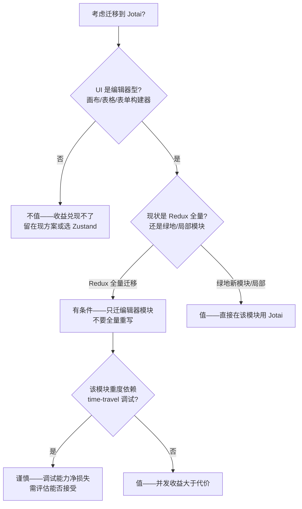

# 交叉挑战 · 产品经理 / ROI 立场

> 阶段：第二阶段交叉挑战（任务 #4）
> 立场：产品经理 / ROI——技术和架构优势只有能换算成「迁移工时省了多少、用户/业务指标动了多少、团队效率提了多少」才算数
> 输入：[tech-expert.md](./tech-expert.md)、[architect.md](./architect.md)、[product-manager.md](./product-manager.md)
> 方法：对每个分歧给出「我坚持 / 我让步 / 有条件成立」的明确判断，不和稀泥

技术专家和架构师的报告都很扎实，但都默认了一个前提：技术上更优的方案，迁移过去就值得。产品经理的工作是把这个前提拆开——把每条纸面优势放到「真实项目 + 真实成本」里重新标价。下面针对三个核心分歧逐一回应。

---

## 分歧一：Zustand 的体积/性能 vs RTK 的强约束——这两条技术/架构优势在真实项目里值多少钱

技术专家主打 Zustand 体积小（0.47KB 核心 / 实用约 1KB）、解析快（8ms vs RTK 34ms）、订阅粒度细；架构师主打 RTK 强约束（combineSlices/inject 动态注入、类型隔离、单向流 + 完整 time-travel）。从 ROI 看，这两条优势的「落地兑现率」差异很大。

### 我的判断：两条都被高估了真实货币价值，但高估的方式不同

**先说 Zustand 的性能优势——纸面真实，但对多数项目的 ROI 接近于零。**

技术专家给的 8ms vs 34ms 解析耗时差是真的，但请注意这是「4x CPU 降速」实验室条件下的绝对值。换算到真实场景：26ms 的解析差，在用户实际感知上低于一帧（60fps 下一帧约 16.7ms，差值约 1.5 帧），且只发生在首次加载、一次性。对一个动辄整体 JS 解析数百毫秒的企业级 SPA，这点差异淹没在噪声里。内存 2.1MB vs 3.2MB（1000 订阅组件）同理——1.1MB 差在今天的设备上不构成业务指标波动。

这些性能优势真正值钱的场景非常窄：**只有当 store 广播更新本身就是性能瓶颈、且页面有成百上千个订阅组件时**（技术专家自己也限定为「画布编辑器、复杂数据可视化」），细订阅粒度才会转化成可感知的帧率提升。对 CRUD 为主的业务后台、营销页、表单流程——95% 的企业前端——这条优势的 ROI 约等于零。我承认它真实，但拒绝把它当作选型的主要驱动力。

**再说 RTK 的强约束优势——这条的 ROI 是真实的，但兑现有前置条件，容易被高估。**

架构师列的 combineSlices/inject 动态注入、withLazyLoadedSlices 类型隔离，确实是 Zustand/Jotai 没有的「机构级能力」。它值钱的地方在于：当团队规模超过 5-10 人、模块超过 50 个时，强约束能阻止 store 退化成大泥球，这部分维护成本的节省是长期复利。我的产品调研也佐证了这点——Redux 对 5-10 人以上团队，初期 2-3 倍的搭建成本会在可维护性上回本。

但「强约束值钱」有一个被架构师弱化的前提：**约束只有在被持续执行时才产生价值，而执行靠的是团队纪律，不是库本身。** combineSlices 的动态注入能力，绝大多数项目根本用不到——它服务的是微前端、插件式架构这类极少数场景。对一个普通的 30 人单体应用，RTK 带来的真实价值不是这些高级 API，而是「单向流 + DevTools 强制了一套大家都遵守的规范」。这个价值真实，但它和「团队本来就有 code review + 架构规范」高度重叠——如果团队纪律已经到位，Zustand + slice 模式 + 约定，也能达到 RTK 八成的结构收益，而省下 RTK 的样板和学习成本。

### 哪些是纸面优势、落地收益有限

把两份报告的优势按「落地 ROI」重新分级：

| 优势主张 | 提出方 | 纸面真实性 | 落地 ROI | 判断 |
|---------|-------|-----------|---------|------|
| Zustand 解析快 26ms / 省 1.1MB 内存 | 技术专家 | 真 | 极低（用户无感、一次性） | 纸面优势，非选型理由 |
| Zustand 订阅粒度细、广播更新快 | 技术专家 | 真 | 仅编辑器/可视化类高（窄场景） | 有条件值钱 |
| Zustand 无 Provider、增量引入成本最低 | 双方 | 真 | **高**（直接降迁移工时） | 真金白银，这才是 Zustand 的核心卖点 |
| RTK combineSlices 动态注入 | 架构师 | 真 | 低（仅微前端/插件架构用得上） | 多数项目纸面优势 |
| RTK 单向流 + time-travel 强约束 | 架构师 | 真 | 中高（≥5-10 人团队、与团队纪律重叠） | 有条件值钱 |
| RTK 类型隔离（多团队不互相依赖） | 架构师 | 真 | 高（仅当真有多团队并行） | 真值钱，但适用面窄 |

**我坚持**：Zustand 真正值钱的不是技术专家强调的体积/解析性能，而是「无 Provider、增量引入成本最低」——这是唯一能直接换算成迁移工时节省的优势。技术专家把性能当卖点，是把窄场景的优势泛化了。

**我坚持**：RTK 的强约束在 ≥5-10 人团队、≥50 模块时 ROI 为正，但 combineSlices 这类高级 API 对普通项目是纸面优势，架构师不应把它作为通用推荐理由。

**我让步**：如果项目确实是多团队并行（不是一个团队假装多团队）、状态高度互相依赖，那么 RTK 的类型隔离和强约束是 Zustand 自律方案无法替代的，这种场景下 RTK 的 ROI 真实为正，迁移/维持 RTK 值得。

---

## 分歧二：RTK 13KB+ 体积是不是硬伤——企业级应用首屏敏感度与对业务指标的真实影响

技术专家把 RTK gzip 13.27KB（含 react-redux 实际约 17KB）当作硬伤，是 Zustand 的 30 倍以上。从产品角度，这个论断需要严重打折。

### 我的判断：这条「硬伤」被显著高估，对企业级应用尤其站不住

**第一，绝对值放进真实 bundle 里微不足道。** 一个典型的企业级 React 应用，仅 React + ReactDOM 运行时 gzip 就约 45KB，加上路由、UI 组件库（MUI/Antd 动辄上百 KB）、图表库、日期库，首屏 JS gzip 普遍在 300KB-1MB 区间。在这个量级里，17KB 占比约 2%-5%。把它叫「硬伤」，相当于说一辆满载卡车多放一箱矿泉水会影响油耗——技术上成立，业务上忽略不计。

**第二，体积对业务指标的传导链条很弱。** 体积影响的是首屏加载时间，首屏时间影响的是跳出率/转化率。但这条链路有两个衰减点:(1) 17KB gzip 在 4G 网络下的下载耗时约几十毫秒，相对动辄 2-4 秒的企业应用首屏，传导到 LCP/FCP 的增量可忽略；(2) **企业级应用的关键区分点在于——它通常是登录后的内部系统/SaaS 后台，用户是员工或付费客户，不是首屏跳失敏感的公域流量。** 公域营销落地页对每 KB 敏感（每 100ms 影响转化率），但那类页面根本不会上 RTK 这种重型状态管理；真正会用 RTK 的企业后台，用户已登录、会长期停留、对首屏多几十毫秒几乎零敏感。技术专家把「体积敏感」从营销页场景错误平移到了企业级场景。

**第三，体积可以被工程手段进一步摊薄。** RTK 支持 code splitting（架构师提到的 combineSlices/inject 本身就是按需加载），状态管理代码完全可以不进首屏 chunk。也就是说，即便这 17KB 存在，也未必落在首屏关键路径上。

### 体积差对业务指标的实际影响量化

| 场景 | 17KB gzip 占首屏比例 | 对 LCP 实际影响 | 对业务指标影响 | 是否硬伤 |
|------|---------------------|----------------|---------------|---------|
| 公域营销落地页（高首屏敏感） | 可能 10%+ | 有感 | 转化率有衰减 | 是——但这类页不该用 RTK |
| 企业级 SaaS 后台（登录后） | 2%-5% | 无感（几十 ms） | 几乎为零 | **否，被高估** |
| C 端高 DAU 应用首屏 | 3%-8% | 轻微 | 边际可测但小 | 部分成立，可 code split 化解 |

**我坚持**：对企业级应用（RTK 的主战场恰恰是企业级），13KB+ 体积不是硬伤，技术专家显著高估了它。理由是企业后台用户已登录、低首屏敏感，且 17KB 在 300KB+ 的真实 bundle 里占比仅 2%-5%，对业务指标传导接近于零。

**我让步**：在公域营销页、C 端高 DAU 首屏敏感场景，体积确实值钱——但这些场景本就不该选 RTK，所以这不构成「RTK 体积是硬伤」的论据，反而印证了「按场景选型」。换句话说，体积差是真实的，但它对 RTK 的目标场景不构成业务伤害。

**我坚持的附加结论**：体积这个维度应该从「RTK 的减分项」重新定性为「Zustand 在体积敏感场景的加分项」。同一个事实，从 ROI 角度该这样表述——不是 RTK 有硬伤，而是 Zustand 在营销页/C 端首屏场景有独特优势。这影响的是 Zustand 的适用边界，不是 RTK 的扣分。

---

## 分歧三：Jotai 并发优势的 ROI——什么场景值这个迁移代价，什么场景不值

技术专家看好 Jotai 的并发优势（原生兼容 useTransition/Suspense、原子级订阅粒度最细、内存最优）。但我的产品调研指出两个硬成本：从 Redux 迁到 Jotai 近乎重写（原子模型是自底向上，和 Redux 自顶向下的状态树范式完全不同，无法逐 slice 平滑迁移），且 DevTools 最弱（jotai-devtools 桥接，time-travel 体验不及 RTK，架构师也确认其调试深度不及）。

### 我的判断：Jotai 的并发收益真实，但迁移代价高到只在极窄场景才值

先把成本和收益对齐到同一杆秤上。

**收益侧（Jotai 独有、其他方案给不了的）：** 原生 Suspense + useTransition 兼容（技术专家详述的 useState 内核选择）、原子级最细订阅粒度、深层异步派生 atom 的优雅组合。这些收益只在一类 UI 里兑现——**高交互密度、大量独立可变状态、需要细粒度异步派生的编辑器型应用**：画布/设计工具、电子表格、复杂表单构建器。架构师和技术专家在这点上一致。

**成本侧（比迁到 Zustand 高得多）：**
1. **迁移近乎重写**：Redux/RTK 是自顶向下单一状态树，Jotai 是自底向上原子组合。两者没有「逐 slice 共存平滑迁移」的桥（不像 Redux→RTK 同源、或 Redux→Zustand 可按组件切）。从 Redux 迁 Jotai 等于把状态层重新建模，工时远高于迁 Zustand。
2. **DevTools 弱**：团队若已习惯 Redux time-travel 调试流，迁到 Jotai 是调试能力的净损失。
3. **原子思维学习曲线 + God Atom 反模式风险**：架构师指出大型团队需自带 FSD 架构纪律才能避免原子退化为隐式耦合。
4. **企业级文档薄**（我的产品调研结论）：复杂场景靠试错。

### ROI 判断：什么场景值 / 不值

**值得这个迁移代价的场景（我支持迁 Jotai）：**
- **绿地的编辑器型新功能/新模块**：没有迁移成本（不是「迁」是「新建」），并发和细粒度收益直接兑现。这是 Jotai ROI 最高的入口——不要全量迁移，而是新模块直接用。
- **既有应用里某个明确的高交互编辑器子页面**：可以把这一个模块的状态用 Jotai 重建，其他模块保持原样（三库可共存，我的产品调研已确认）。代价被局部化，收益集中在最需要的地方。

**不值得的场景（我反对迁 Jotai）：**
- **CRUD/表单流程/管理后台为主的应用全量迁移**：并发优势兑现不了（这类 UI 没有 Jotai 擅长的细粒度异步派生需求），却要付近乎重写的成本 + DevTools 净损失。ROI 明确为负。如果只是嫌 Redux 样板多，迁 Zustand 性价比远高于 Jotai——同样减样板，但迁移成本低一个量级、且保留 DevTools。
- **团队重度依赖 time-travel 调试**：Jotai 是调试能力净损失，除非编辑器收益足够大到能覆盖这个损失。

### 三句话结论

**我坚持**：Jotai 的并发优势是真实的技术领先，但「从 Redux 全量迁移到 Jotai」在绝大多数业务应用里 ROI 为负——迁移近乎重写 + DevTools 净损失，而并发收益在 CRUD 类应用根本兑现不了。

**我让步**：在编辑器型 UI（画布/表格/表单构建器）这个窄场景，Jotai 的并发和细粒度收益确实值得代价，技术专家的看好成立。

**有条件成立**：正确的落地姿势不是「迁移」而是「局部采用」——绿地编辑器模块直接用 Jotai，或既有应用里只把某个高交互编辑器子页面用 Jotai 重建，把迁移代价局部化、把收益集中化。全量迁移到 Jotai 几乎在任何场景都不是好的 ROI 选择。

---

## 总结：产品/ROI 视角的三条核心立场

把三个分歧的判断收敛成产品经理对最终选型的输入:

1. **性能/体积之争被双向高估，迁移成本才是真变量。** Zustand 的解析/内存优势对 95% 项目 ROI 约等于零，RTK 的 13KB 体积对其企业级目标场景也不是硬伤。真正值钱、能换算成工时的，是 Zustand「无 Provider、增量引入成本最低」这一条。选型不该被纸面性能数字主导。

2. **RTK 的强约束值钱，但前提是真有多团队/大规模 + 缺乏团队纪律。** 如果团队已有 code review 和架构规范，Zustand + 约定能拿到 RTK 八成结构收益而省下样板成本；只有真正多团队并行、状态高度互相依赖时，RTK 的类型隔离和动态注入才不可替代。

3. **Jotai 不是「迁移」目标，是「局部采用」工具。** 它的并发优势只在编辑器型 UI 兑现，而全量迁移代价近乎重写。正确 ROI 姿势是绿地新模块或局部编辑器子页面直接用 Jotai，绝不全量迁移。

一以贯之的产品立场:**技术先进性不等于商业价值，迁移决策的标尺是「省下的工时 + 动了的业务指标」，而不是 benchmark 数字。** 现有 Redux 如果没有明确痛点，「不迁」往往是 ROI 最高的选择；要迁，Zustand 是性价比最高的默认项，RTK 留给真·大规模多团队，Jotai 留给编辑器型局部场景。
