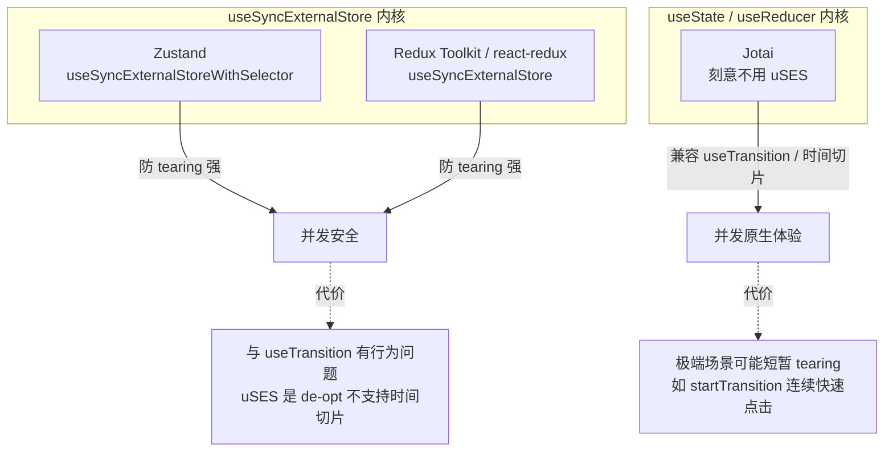

# 状态管理方案技术调研：Zustand / Redux Toolkit / Jotai

> 调研维度：纯技术（API 范式、TypeScript、运行时性能、并发模式、Bundle 体积）
> 数据时间：2025–2026 年初
> 版本基线：zustand 5.0.x / jotai 2.20.x / @reduxjs/toolkit 2.12.x（实测于 bundlephobia API，见末尾数据来源）

---

## 一、API 设计范式与心智模型

三者代表了三种根本不同的状态建模哲学，这决定了后续所有的性能与类型表现。

| 维度 | Zustand | Redux Toolkit | Jotai |
|------|---------|---------------|-------|
| 范式 | 集中式 Store（Module-first） | Flux / 单一不可变状态树 | 原子化（Atom，Bottom-up） |
| 状态组织 | 单个对象，自顶向下 | 单个对象，reducer 驱动 | 多个独立 atom，自底向上 |
| 类比 | 类似 Redux 的轻量版 | 经典 Flux | 类似 Recoil / `useState`+`useContext` 的替代品 |
| 更新方式 | `set()` 直接赋值（支持局部 mutate） | dispatch action → reducer（Immer 包裹，可写「可变」代码） | `set(atom, value)` 写入单个原子 |

Zustand 的核心是一个返回 hook 的 store，`set`/`get` 直接操作状态，没有 action/reducer 的中间层。Redux Toolkit 用 `createSlice` + `configureStore` 大幅削减了样板代码，并内置 Immer，让你能写「看似可变」的 reducer，同时保留时间旅行调试。Jotai 把状态拆成一个个 atom，组件只订阅它消费的那几个 atom，天然贴合派生/计算状态的组合。

官方对照（jotai.org/docs/basics/comparison)直接给出定位口诀：「Jotai is like Recoil. Zustand is like Redux」「想要 `useState`+`useContext` 替代品选 Jotai；想要简单 module state 选 Zustand；想用 Redux DevTools 选 Zustand；想要构建自己库的原语选 Jotai」。

### Provider 需求

这是一项关键的工程化差异，直接影响接入成本：

- **Zustand**：无需 Provider。store 是一个模块级单例，任意组件直接 import 使用（module-first），这是它接入成本最低的核心原因。
- **Redux Toolkit**：必须用 `<Provider store={store}>` 包裹应用根节点，依赖 React Context 下发 store。
- **Jotai**：默认提供 Provider-less 模式（context-first, module-second），单 store 场景可不写 Provider；但多 store 隔离、SSR、测试隔离场景仍需 `<Provider>`。

### TypeScript 类型推断质量

三者在 2026 年的多份对比中均拿到 TypeScript ★★★★★ 满分评级，但「推断路径」不同：

- **Zustand**：需要显式标注一次 store 形状，采用 curried 写法 `create<T>()((set) => ({...}))`。这一次标注之后，所有 selector、action 的推断都很干净。自带类型定义，无需额外安装 `@types`。
- **Jotai**：推断「开箱即用」——atom 从初始值自动推断类型（`atom(0)` → `PrimitiveAtom<number>`），需要显式控制时再用泛型 `atom<Type>(...)`。从设计之初就是 TypeScript-first，派生 atom 的类型自动沿依赖链流动。
- **Redux Toolkit**：`createSlice` 能自动推断 action creator 与 state 类型，但跨组件读取通常需要手写 `RootState = ReturnType<typeof store.getState>` 这类辅助类型。

结论：类型质量三者无明显高下，差异在范式偏好——Jotai 是「每块状态自底向上、零标注推断」，Zustand 是「单 store 顶层标注一次、全局复用推断」，RTK 是「slice 自动推断 + 顶层辅助类型」。

---

## 二、运行时性能

### 订阅粒度（决定不必要的重渲染）

订阅粒度是三者性能差异的根源：

- **Jotai —— 原子级，粒度最细**。组件只在它实际使用的 atom 变化时重渲染。某个 atom 更新，只有消费该 atom 的组件刷新。这使 Jotai 在「超细粒度响应」场景（画布编辑器、复杂数据可视化、深层嵌套派生状态）表现最优。
- **Zustand —— selector 级**。通过 selector 函数 + memoization 实现细粒度订阅，底层用 `useSyncExternalStoreWithSelector` 对选中的快照子集做记忆化。**关键陷阱**：selector 应返回原始值；若返回新建对象/数组，`Object.is` 每次比较都为 false，会陷入无限重渲染——需配合 `useShallow` 或自定义 equality。Zustand 更擅长「大范围状态广播更新」。
- **Redux Toolkit —— selector + memoization**。依赖 `useSelector` + reselect/`createSelector` 做记忆化；集中式状态树在大型应用中若不精心做选择性渲染，容易出现性能瓶颈。

一句话概括各自最优场景：**Zustand 对大范围状态更新快，Jotai 对超细粒度响应快**。

### 1000 组件订阅基准（内存 + 解析耗时）

来自同一组基准测试（Better Stack）的横向数据：

| 指标 | Zustand | Jotai | Redux Toolkit |
|------|---------|-------|---------------|
| 内存占用（1000 个订阅组件） | 2.1 MB | **1.8 MB** | 3.2 MB |
| 初始 bundle 解析耗时（4x CPU 降速） | **8 ms** | 9 ms | 34 ms |

Jotai 在大量细粒度订阅下内存最优（原子模型按需订阅），Zustand 解析最快，RTK 因体积与中间件解析耗时显著偏高（约为前两者的 4 倍）。

### 大数据流与复杂表单场景

- **复杂表单 / 表单密集页**：原子化（Jotai）或 selector 隔离（Zustand）优势明显。一份真实迁移案例报告：从 Redux 迁移后表单密集页的重渲染下降约 **45%**，bundle 体积下降约 **18%**（移除重型中间件与样板）。表单每个字段对应独立 atom 时，单字段输入不会触发整表单重渲染。
- **大数据流广播**：Zustand 的「单 store + 局部 selector」在需要把一份大状态广播给很多组件、但各组件只取一小片时表现稳定；Jotai 在「深层多级 async 派生 atom」组合下需警惕 await 链路引发的 Suspense 级联（见下文 v2 注意点）。

### React 18+ Concurrent Mode 兼容性

这是三者最深的技术分野，根源在于 React 绑定层用的内核 hook 不同：

**Zustand / react-redux 走 `useSyncExternalStore`（uSES）路线**：
- 优势：从框架层杜绝 **tearing**（撕裂——并发渲染下不同组件读到同一外部 store 的新旧不一致值）。uSES 保证同一渲染批次内所有组件读到一致快照。
- 代价：uSES 的「Sync」本质是一个 **de-opt**，**不支持时间切片（time slicing）**。因此 Zustand 在 `useTransition` 下存在已知行为问题——外部 store 的 mutation 无法被标记为非阻塞的 Transition 更新。
- Suspense 注意点：官方明确「不建议基于 uSES 返回的 store 值去 suspend 渲染」，否则 store mutation 会触发最近的 Suspense fallback，把已渲染内容替换成 loading，体验差。

**Jotai 刻意不用 uSES，改用 `useState`/`useReducer` 内核**：
- 作者 Daishi Kato 的设计取舍：Jotai 模仿 `useState`，因此与 `useTransition` 行为一致、原生兼容时间切片和 Suspense。代价是极端场景可能出现「短暂 tearing」——例如用非 hook 版 `startTransition` 连续快速双击时，两个 transition 顺序执行导致部分组件读到新值。
- 用 `useTransition` hook 版可规避：React 会丢弃第一个 in-flight transition、直接跑完第二个，反而更快到达最终态、无 tearing。
- 官方定位：「想用 Suspense，选 Jotai」。异步派生 atom 用「continuable promise」机制，依赖变化时自动采用最新 in-flight promise；`unwrap`/`loadable` 工具可把 async atom 转 sync，缓解 v2 中 `get` 需 await 导致的多级 await → Suspense 级联问题。

**Redux Toolkit（经 react-redux 9.x）**：react-redux v8+ 已内部采用 `useSyncExternalStore`，因此同样具备 tearing 安全，并发兼容性与 Zustand 同属 uSES 阵营。

并发模式选型小结：**追求 tearing 绝对安全、状态广播为主 → uSES 阵营（Zustand/RTK）；重度依赖 Suspense + useTransition 的异步派生体验 → Jotai。**

---

## 三、Bundle 体积（gzip 精确数值）

实测自 bundlephobia API（数值已换算为 KB，2 位小数），版本见标题栏：

| 包 | 版本 | Minified | **Gzip** | 依赖数 |
|----|------|----------|----------|--------|
| zustand（core） | 5.0.14 | 0.82 KB | **0.47 KB** | 0 |
| jotai | 2.20.0 | 9.10 KB | **3.85 KB** | 0 |
| @reduxjs/toolkit | 2.12.0 | 36.11 KB | **13.27 KB** | 6 |
| react-redux（RTK 实际需搭配） | 9.3.0 | 9.50 KB | **3.68 KB** | 2 |

体积解读：

- **Zustand** 是绝对的体积王者：核心 gzip **0.47 KB**、零依赖。注意 0.47 KB 是 `zustand` 入口的核心；常用的 `zustand/react`、`middleware` 按需引入后实际占用通常落在 ~1 KB 量级，仍是三者中最小。
- **Jotai** gzip **3.85 KB**、零依赖，体积适中。
- **Redux Toolkit** gzip **13.27 KB**、6 个依赖；且实际 React 应用还需搭配 `react-redux`（额外 ~3.68 KB gzip），**真实接入总成本约 17 KB gzip**，是 Zustand 的 30 倍以上、Jotai 的 4 倍以上。这与「1000 组件基准」中 RTK 解析耗时 34ms（约 4x）的结论一致——体积大直接转化为解析成本。

---

## 四、生态与采用度（辅助数据）

npm 周下载量（last-week，实测自 npm registry API）：

| 包 | 周下载量 |
|----|----------|
| zustand | ~3,898 万 |
| @reduxjs/toolkit | ~2,059 万 |
| react-redux | ~2,712 万 |
| redux | ~3,343 万 |
| jotai | ~486 万 |

GitHub stars（npm-compare）：zustand ~58.2k > jotai ~21.2k > @reduxjs/toolkit ~11.2k。

趋势：Zustand 逐年上升、已成新项目默认首选；Jotai 稳步上升（Suspense 集成是亮点）；RTK 作为成熟库整体稳定，但新中小项目采用率持平或略降。Redux 全家桶下载量仍高，主要来自存量大型项目。

注：RTK star 数低于 Zustand，部分原因是 Redux 生态 star 分散在 `redux`/`react-redux`/`@reduxjs/toolkit` 多个仓库。

---

## 五、核心结论（纯技术维度）

1. **体积**：Zustand 碾压级最小（~0.47 KB gzip 核心 / 实用约 1 KB），Jotai 居中（3.85 KB），RTK 最重（含 react-redux 实际约 17 KB gzip）。
2. **订阅粒度**：Jotai 原子级最细、最省重渲染；Zustand selector 级（需防 `Object.is` 陷阱）；RTK 依赖 reselect 记忆化，集中式树需手工优化。
3. **并发模式**：Zustand/RTK 走 uSES，tearing 绝对安全但不支持时间切片、`useTransition` 有行为问题；Jotai 走 useState 内核，原生兼容 useTransition/Suspense，代价是极端场景短暂 tearing。重度 Suspense 异步派生选 Jotai。
4. **API/Provider**：Zustand 无需 Provider、接入成本最低；Jotai 默认 Provider-less（多 store/SSR 需 Provider）；RTK 强制 Provider + slice 范式。
5. **TypeScript**：三者均 ★★★★★。Jotai 推断最「开箱即用」（atom 从初值推断），Zustand 顶层标注一次后全局复用，RTK slice 自动推断但跨组件需 `RootState` 辅助类型。

---

## 数据来源

性能与综合对比：
- [Better Stack — Zustand vs. Redux Toolkit vs. Jotai](https://betterstack.com/community/guides/scaling-nodejs/zustand-vs-redux-toolkit-vs-jotai/)（1000 组件内存/解析基准、bundle 区间、DevTools 评级）
- [DEV — State Management in 2026: Zustand vs Jotai vs Redux Toolkit vs Signals](https://dev.to/jsgurujobs/state-management-in-2026-zustand-vs-jotai-vs-redux-toolkit-vs-signals-2gge)（TypeScript ★★★★★ 评级、趋势）
- [npm-compare — zustand/jotai/RTK/valtio/recoil](https://npm-compare.com/@reduxjs/toolkit,zustand,recoil,jotai,valtio/)（GitHub stars）

Bundle 体积（精确 gzip）：
- bundlephobia API：`https://bundlephobia.com/api/size?package=zustand` / `jotai` / `@reduxjs/toolkit` / `react-redux`（实测 2025-2026 版本，见正文表格）

npm 下载量：
- npm registry downloads API：`https://api.npmjs.org/downloads/point/last-week/{package}`

并发模式 / useSyncExternalStore：
- [Why useSyncExternalStore Is Not Used in Jotai — Daishi Kato](https://blog.axlight.com/posts/why-use-sync-external-store-is-not-used-in-jotai/)（uSES 是 de-opt、不支持时间切片）
- [How to Use Jotai and useTransition for Mutation — Daishi Kato](https://blog.axlight.com/posts/how-to-use-jotai-and-use-transition-for-mutation/)（Jotai 模仿 useState、兼容 useTransition）
- [React Tearing in Jotai and Reducer — pmndrs/jotai Discussion #2752](https://github.com/pmndrs/jotai/discussions/2752)（startTransition vs useTransition tearing 分析）
- [React's useSyncExternalStore & Zustand Guide](https://ishqelliot.hashnode.dev/underrated-react-api-usesyncexternalstore-and-understanding-zustand)（Zustand 用 useSyncExternalStoreWithSelector、selector 返回原始值陷阱）

API 范式 / TypeScript / Provider：
- [Jotai 官方 Comparison 文档](https://jotai.org/docs/basics/comparison)（atom vs store、Provider、Suspense、referential identity）
- [Better Stack（同上）](https://betterstack.com/community/guides/scaling-nodejs/zustand-vs-redux-toolkit-vs-jotai/)（curried 写法、createSlice 推断）
