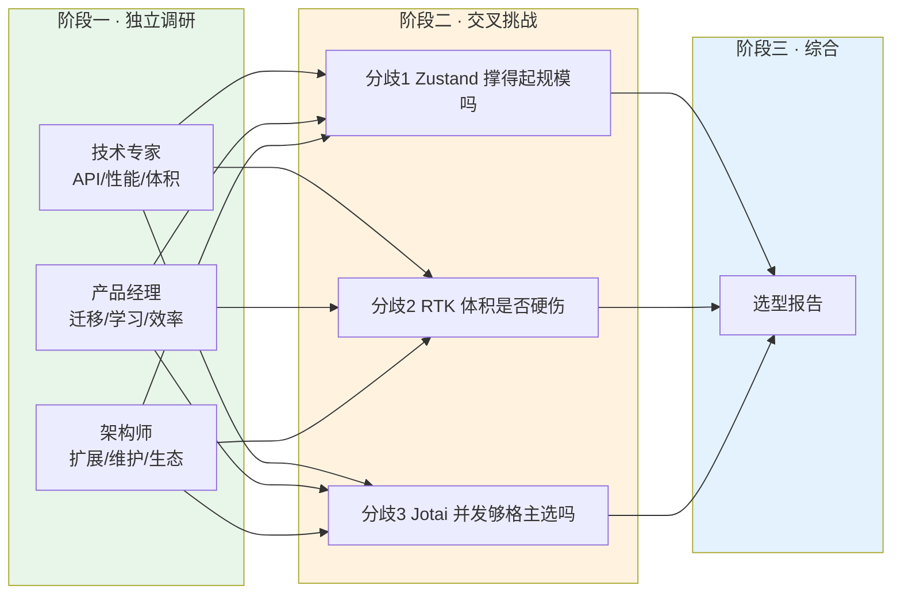
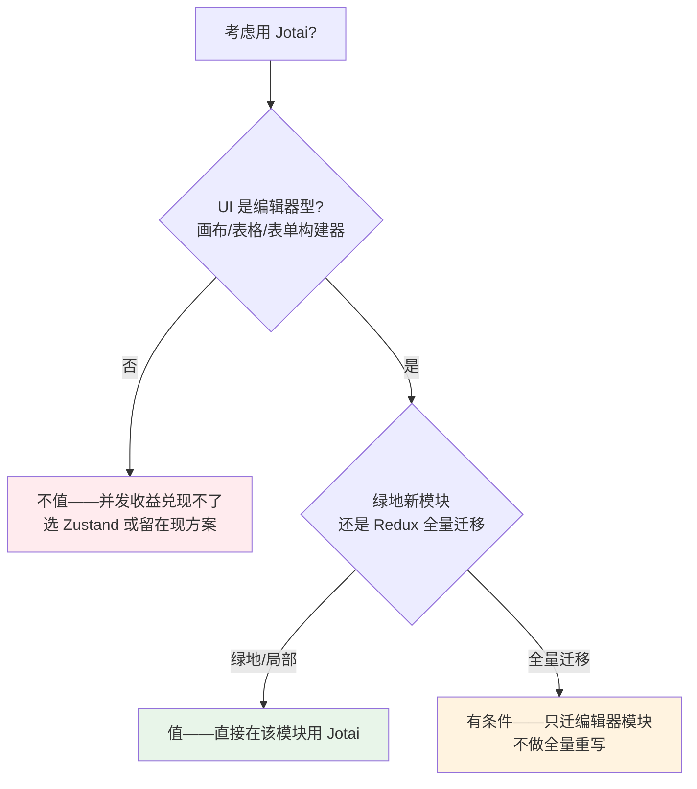
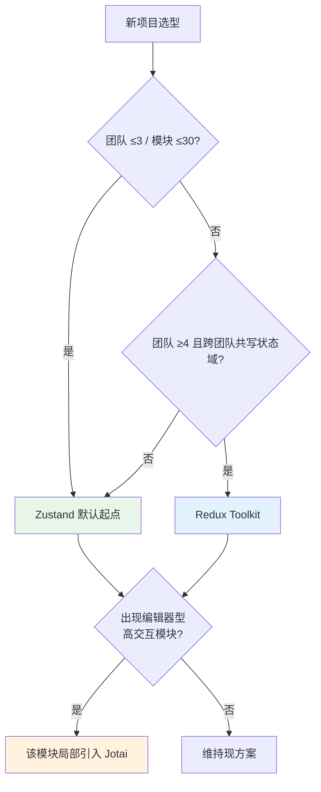

# 状态管理方案综合选型报告

**调研方案**：Zustand · Redux Toolkit · Jotai
**协作团队**：技术专家 · 产品经理 · 架构师（Agent Team 三角色独立调研 + 交叉挑战）
**数据基线**：zustand 5.0.14 · jotai 2.20.0 · @reduxjs/toolkit 2.12.0 · react-redux 9.3.0 · @tanstack/react-query 5.101.0（实测 Bundlephobia / npm registry API）
**日期**：2026-06-06

> 本报告由三个角色各自独立调研后互相挑战、修正口径、明确让步而成。与单轮调研最大的不同在于：几条流行结论（"RTK 体积是 Zustand 30 倍"、"Jotai 是唯一无妥协的并发方案"）在交锋中被作者本人主动修正，最终保留下来的判断都经过了对抗性验证。

---

## 一、协作过程：三阶段如何收敛

团队按"独立调研 → 交叉挑战 → 综合"三阶段推进。第一阶段三人互不可见，各从技术、产品、架构维度独立取证；第二阶段每人被指派一个对抗性立场，强制去读另两份并质疑，而非互相点赞。这个设计逼出了三处关键的自我修正。

交叉挑战阶段产生的三次修正值得单独点名，因为它们改变了结论的可信度：技术专家把第一阶段的"RTK 体积是 Zustand 30 倍"收回，改用真实全栈口径重算；同样收回了"Jotai 是唯一无妥协的 Concurrent 选项"这个过强措辞；架构师则在数据复核中纠正了几处沿用二手概数的包体积，全部换成 Bundlephobia 一手实测。经过对抗后留下来的结论，比任何一方的初稿都更稳。

---

## 二、各维度核心发现

### 技术维度

三者的 API 分属三种范式：Redux Toolkit 延续 Flux 的单一 store + slice + action，强制 Provider；Zustand 走极简 hook 路线，无 Provider、无 reducer，四行即可起一个 store；Jotai 完全模仿 `useState`，自底向上用原子组合状态。TypeScript 支持上三者都到位，差异只在推断范式——Jotai 开箱即用、Zustand 顶层标注一次、RTK 靠 slice 自动推断加 `RootState` 辅助类型。

**包体积**（Bundlephobia 实测，min+gzip）的量级关系稳定成立：Zustand 核心 0.47KB（零依赖）≪ Jotai 3.85KB（零依赖）< RTK 13.27KB，加上 react-redux 3.68KB，RTK 真实接入约 17KB。但这个"裸库对比"在交叉挑战中被重新核算（见分歧二），结论是单独比库本体会误导决策。

**订阅粒度与运行时性能**呈现清晰梯度：Jotai 原子级订阅最细、最省重渲染；Zustand 是 selector 级，有一个著名陷阱——selector 必须返回原始值，否则 `Object.is` 比较失败会陷入无限重渲染，需要 `useShallow` 兜底；RTK 依赖 reselect 记忆化、集中式树需手工优化。1000 组件订阅基准下，内存占用 Jotai 1.8MB < Zustand 2.1MB < RTK 3.2MB，解析耗时 Zustand 8ms < Jotai 9ms ≪ RTK 34ms（4x CPU 降速实验条件）。

**并发模式是三者最深的分野**。Zustand 和 RTK 都走 `useSyncExternalStore`，tearing 绝对安全，但 `uSES` 本质是 React 的 de-opt，不支持时间切片，`useTransition` 下有行为问题——外部 store 的 mutation 无法被标记为非阻塞 Transition 更新。Jotai 刻意不用 `uSES`、改用 `useState` 内核，原生兼容 `useTransition` 和 Suspense，官方定位就是"想用 Suspense 选 Jotai"。代价是极端场景（非 hook 版 `startTransition` 连续快速点击）可能短暂 tearing。两边都是 trade-off，没有无妥协的一方。

### 产品维度

**学习曲线**梯度明显：Zustand 最平缓（会 hooks 就会用，约 4 行起一个 store）> Jotai（需要从"集中 store"到"原子依赖图"的心智转换，中小应用上手可低于 1 小时，但企业级文档偏薄）> Redux Toolkit（store/slice/action/reducer/middleware 多概念，搭建耗时是前两者的 2-3 倍）。

**迁移成本**上有一个容易被忽略的好消息：迁到 Zustand 不会丢失 Redux DevTools 的时间旅行能力，用 devtools middleware 即可复用同一个浏览器扩展，迁移阻力比想象中小。三者也都支持与现有 Redux 渐进式共存、逐 store 替换、小步发布回滚，不需要大重写。实践锚点是 Shopify POS 的迁移案例（约 3 个月、删掉约 3500 行样板代码）。要规避的反模式是"Redux 与新库双向同步桥"。

**社区动能**（npm registry API 实测周下载量）：TanStack Query ~5463 万领跑整个数据层，Zustand ~3898 万、redux ~3343 万、react-redux ~2712 万、@reduxjs/toolkit ~2059 万、Jotai ~486 万。Zustand 增长最快、已与 Redux 系同量级，Jotai 小而稳（约为 Zustand 的 1/8）。维护方都活跃可信——RTK 是 Redux 官方团队，Zustand 与 Jotai 同属 pmndrs（Daishi Kato）。作为反例，Recoil 已被 Meta 于 2025-01-01 正式归档、只读、与 React 19 不兼容，这反过来强化了"要原子化就选 Jotai 而非 Recoil"的判断。

### 架构维度

**扩展性**上，50+ 模块、多团队场景 RTK 最稳——RTK 2.0 的 `combineSlices` 配合 `inject()` / `withLazyLoadedSlices` 原生支持懒加载注入且类型隔离，团队之间无需互相 import 状态定义。Zustand 增量引入成本最低，但扁平 store 在规模下容易退化，官方文档自己就承认"store can become bigger and bigger and tougher to maintain"。Jotai 的原子天然解耦、利于并行，但无约定时易生"God Atom"隐式耦合，需要 Feature-Sliced Design 这类外部纪律兜底。

**维护性**的分野最大一项是调试可追溯性。RTK 的单向数据流加完整 time-travel 让状态变化高度可预测，代价是样板；Zustand 没有正式的 action 概念，接 Redux DevTools 也拿不到逐条 action 回放；Jotai 的 `jotai-devtools` 支持 time-travel 但成熟度最弱，且 `snapshotHistoryLimit` 默认 Infinity 会吃内存。

**生态成熟度**有一个三方共识的前提：server state 必须与 client state 分离。RTK 内置 RTK Query 最一体化；Zustand 必须外接 TanStack Query；Jotai 用 `atomWithQuery` 且原生集成 Suspense。这个前提直接决定了体积该怎么算（见分歧二）。

---

## 三、跨角色分歧与交锋结论

三个核心分歧在第二阶段被逐条对抗，每一条都给出了"坚持/让步/有条件成立"的明确判定，而非和稀泥。

### 分歧一：Zustand 是"最佳平衡点"——性能好就够了吗？

技术专家主张 Zustand 在体积、解析速度、接入成本上综合最优。架构师反驳的核心是时间轴错配：体积、解析耗时、接入成本都是"上手期"指标，在 store 还小、团队还小时就能拿到收益且此后不再恶化；而可维护性是"规模期"指标，随 store 和团队数量非线性放大，早期完全看不见。用早期指标给规模期方案打分，是评估时间轴的错配。

交锋的结果是双方各让一步，边界反而更清晰。技术专家**让步**承认性能和架构约束不是同一维度、抵消不了，但**反驳**了一处评级不对称——架构师给同样"无约定"的 Jotai 判"中风险"、给 Zustand 判"中高"，而 Zustand 有官方 slice 模式，约束完全可以由 slice + ESLint + FSD 工程手段补齐，没理由被单独判更高风险。架构师接受这个反驳，转而给出可操作的硬上限。

最终三方收敛到一条边界，而非一个赢家。产品经理补充了关键的 ROI 视角：Zustand 真正值钱的不是技术专家强调的体积/解析性能（对 95% 的 CRUD 业务项目 ROI 约等于零、用户无感且一次性），而是"无 Provider、增量引入成本最低"——这是唯一能直接换算成迁移工时节省的优势。

**Zustand 的硬上限**：出现以下任一信号时，它的"无约束"从优点变成负债，应转向 RTK——团队数 ≥ 4 且需要往同一状态域写入（跨团队耦合无约定兜底）、需要按路由懒加载状态分片且要求编译期类型隔离、调试核心诉求是逐 action 回放。在"中等耦合 + 有架构纪律"的 50+ 模块项目里，Zustand 的优势依然成立。

### 分歧二：RTK 13KB 体积是不是硬伤？

这是对第一阶段结论最直接的挑战，结果是提出方主动修正了口径。技术专家承认"30 倍"是孤立库本体的对比口径，严格说对比的不是同一使用单位——现实里没人只装 client-state 库，正确的对比单位是完整数据层。按真实全栈重算：

| 组成 | A 栈（Zustand + TanStack Query） | B 栈（RTK 全家桶） |
|------|-------------------------------|------------------|
| client-state | zustand 0.47 KB | @reduxjs/toolkit（含 RTK Query）13.27 KB |
| server-state | @tanstack/react-query 13.26 KB | （已内置在 RTK 里） |
| React 绑定 | （zustand 自带） | react-redux 3.68 KB |
| **gzip 合计** | **≈ 13.7 KB** | **≈ 22.7 KB** |

换最有利于 RTK 的全栈口径后，方向不变——B 栈仍重约 9KB gzip、约 1.65 倍，解析成本约 4 倍。RTK Query 内置抵消的是"接入复杂度和依赖管理心智"，不是字节；官方明说 RTK Query 是"fixed one-time amount"，已用 RTK 还要 +~11KB。所以"整体 bundle 不一定更大"这个说法不成立，但"RTK Query 带来一体化心智优势"这个修正后的说法成立。

产品经理从业务角度给出了更彻底的判断：这条"硬伤"被显著高估。17KB 放进企业级应用 300KB-1MB 的真实首屏 bundle 里只占 2%-5%，而 RTK 的主战场恰恰是登录后的内部系统/SaaS 后台——用户是员工或付费客户、会长期停留、对首屏多几十毫秒近乎零敏感。公域营销页确实对每 KB 敏感，但那类页面本就不该上 RTK。

三方共识：体积差是真实的，但应从"RTK 的减分项"重新定性为"Zustand 在体积敏感场景（营销页/C 端首屏）的加分项"。这影响的是 Zustand 的适用边界，不是 RTK 的扣分。决策该比的是整套数据栈的总成本，不是状态库的裸体积。

### 分歧三：Jotai 的并发优势够格当主选吗？

技术专家第一阶段称 Jotai 是"唯一无妥协的 Concurrent 选项"，交叉挑战中主动收回了"无妥协"三个字——Jotai 的并发兼容是用"极端场景可能短暂 tearing"换来的，本身也是 trade-off，只是妥协点和 Zustand/RTK 不同。

但收回措辞之后，技术专家坚持一个机制级的核心：存在三类场景，`uSES` 阵营（Zustand/RTK）从机制上做不到，不是优化问题而是能力问题——`useTransition` 驱动的非阻塞重渲染（拖动筛选条时旧结果保持可交互、新结果后台并发渲染）、Suspense 原生集成的异步派生状态（一个 atom 异步加载触发多个派生 atom 自动重算并按需 suspend）、以及成百上千独立单元格各自为 atom 的细粒度反应式编辑器。

架构师从维护性角度给出了权重判断：并发优势是"少数高价值模块的天花板"，维护痛点（atom 依赖图无强制约定易隐式耦合、DevTools 三者最弱、企业级文档与采用率双低）是"全体团队日常追溯与新人爬坡的地板"。在以多团队长期维护为主线的选型里，后者面积更大。产品经理则把账算到 ROI 上：从 Redux 全量迁 Jotai 近乎重写（原子模型自底向上、与 Redux 状态树范式不同、没有逐 slice 平滑迁移的桥），叠加 DevTools 净损失，在 CRUD 类应用里 ROI 明确为负。

三方收敛到一个一致姿势：**Jotai 是"局部采用"工具，不是"迁移"目标**。正确落地是在绿地的编辑器型新模块直接用 Jotai，或把既有应用里某个高交互编辑器子页面用 Jotai 重建，把代价局部化、收益集中化——而不是全量迁移。

---

## 四、综合推荐矩阵

| 场景 | 推荐方案 | 核心理由 |
|------|---------|---------|
| 小型 SPA / 原型 / 内部工具 | **Zustand** | 0.47KB 核心、上手约 4 行、无 Provider、无样板 |
| 中型应用（5-30 模块） | **Zustand + TanStack Query** | client/server 职责分离，全栈仅 ~13.7KB，开发效率最高 |
| 大型企业应用（50+ 模块，团队 ≥4 且跨团队共写状态域） | **Redux Toolkit** | 编译期类型隔离 + 懒加载注入 + 完整 time-travel，强约束保代码质量 |
| 编辑器型 UI（画布/电子表格/表单构建器/实时协作） | **Jotai（局部采用）** | 原子级订阅 + useState 内核并发，`uSES` 阵营机制上无法复制 |
| 重 Server State 场景 | **RTK + RTK Query** | 一体化减少多库协调与依赖管理心智 |
| 公域营销页 / C 端首屏敏感 | **Zustand** | 体积敏感场景的加分项；这类页本就不该上 RTK |
| 从 Redux 迁移（保守） | **升级到 RTK** | 同源、兼容现有结构、渐进升级 |
| 从 Redux 迁移（激进减样板） | **渐进迁移到 Zustand** | 保留 Redux DevTools，迁移成本比迁 Jotai 低一个量级 |
| 现有 Redux 无明确痛点 | **不迁** | 迁移成本动辄数万美元工时，无痛点时"不迁"ROI 最高 |

---

## 五、迁移路径与最终结论

如果当前使用 Redux（非 RTK），渐进式路径优先于大规模重构。第一步用 `createSlice` 替换现有 reducer 升级到 RTK，不改变架构；第二步评估团队规模与模块数，若 ≤30 模块可同步引入 Zustand 处理 UI 状态、RTK 保留全局业务状态、TanStack Query（或 RTK Query）接管 server state；第三步若出现细粒度性能瓶颈（大型表格、复杂表单构建器），在对应模块局部引入 Jotai。

三种工具不互斥。经过交叉挑战，团队确认 **RTK 管全局业务状态 + TanStack Query/RTK Query 管服务端状态 + Jotai 管局部精细状态** 是社区验证过的成熟分层模式。

最终结论分三句：**Zustand 是 2026 年大多数新项目的默认起点**——体积最小、上手最快、生态活跃、在"中等耦合 + 有纪律"的中等规模下性能与可维护性都够用，且它真正不可替代的价值是"无 Provider、增量引入成本最低"，而非 benchmark 数字。**当团队跨过 ≥4 团队共写状态、需编译期类型隔离、需逐 action 回放调试这些硬信号时，RTK 的强约束 ROI 转正**，向它演进有充分支撑。**Jotai 是局部特化工具而非通用主选**——只有当 UI 核心交互建立在"并发非阻塞渲染 + 细粒度异步派生"之上时（编辑器、设计工具、复杂实时筛选），它的并发能力才是机制级刚需，值得为之付 DevTools 与原子思维的入场费；离开这类场景，工程税不划算。

贯穿三个维度的方法论是：技术先进性不等于商业价值，选型应显式区分"项目处于哪个规模带、是否数据密集、反应式 UI 占多大比重"，而不是追求一个放之四海皆准的赢家。很多流行结论在限定场景里完全正确，错的是把限定场景结论当成通用结论。

---

## 六、数据来源

包体积与采用率（一手实测）：
- Bundlephobia API：zustand@5.0.14 0.47KB · jotai@2.20.0 3.85KB · @reduxjs/toolkit@2.12.0 13.27KB · react-redux@9.3.0 3.68KB · @tanstack/react-query@5.101.0 13.26KB（均 min+gzip）
- npm registry API 周下载量：@tanstack/react-query ~5463 万 · zustand ~3898 万 · redux ~3343 万 · react-redux ~2712 万 · @reduxjs/toolkit ~2059 万 · jotai ~486 万

官方与社区文献：
- [Redux Toolkit — RTK Query Overview](https://redux-toolkit.js.org/rtk-query/overview)（server state 能力内置主包、fixed one-time cost）
- [Redux Toolkit — combineSlices API](https://redux-toolkit.js.org/api/combineSlices)（inject / withLazyLoadedSlices 类型隔离）
- [Zustand 官方 — Slices Pattern](https://zustand.docs.pmnd.rs/learn/guides/slices-pattern)（官方承认 store 会变难维护）
- [pmndrs/zustand Discussion #2496](https://github.com/pmndrs/zustand/discussions/2496)（单 store vs 多 store 口径冲突）
- [pmndrs/zustand Discussion #1355](https://github.com/pmndrs/zustand/discussions/1355)（拆 slice 不改善性能）
- [Daishi Kato — Why useSyncExternalStore Is Not Used in Jotai](https://blog.axlight.com/posts/why-use-sync-external-store-is-not-used-in-jotai/)
- [Daishi Kato — How to Use Jotai and useTransition for Mutation](https://blog.axlight.com/posts/how-to-use-jotai-and-use-transition-for-mutation/)
- [Jotai 官方 — Comparison](https://jotai.org/docs/basics/comparison)（Suspense 原生集成）
- [Feature-Sliced Design · Jotai Minimalist Architecture](https://feature-sliced.design/blog/jotai-minimalist-architecture)（God Atom 反模式与 FSD 兜底）
- [brainhub — Zustand Architecture Patterns at Scale](https://brainhub.eu/library/zustand-architecture-patterns-at-scale)
- Recoil 归档状态：Meta 于 2025-01-01 正式归档（GitHub 仓库 只读 + Discussion #2171）

> 三份独立调研与三份交叉挑战的完整记录见 `.claude/research/` 目录：`tech-expert.md` / `product-manager.md` / `architect.md` 及对应的 `*-challenge.md`。
