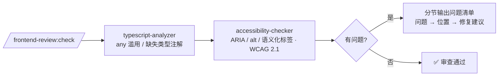

# frontend-review

一个用于**前端代码审查**的 Claude Code 插件。一条 `/frontend-review:check` 命令依次调度两个 subagent——`typescript-analyzer` 排查类型隐患、`accessibility-checker` 核查无障碍问题——最后汇总成一份审查报告;全部通过时输出 `✅ 审查通过`。

## 组件构成

| 类型 | 名称 | 作用 |
| --- | --- | --- |
| Skill | `check` | 审查入口。按顺序调起两个 subagent 并汇总结果 |
| Subagent | `typescript-analyzer` | 检查 `any` 滥用与缺失的类型注解,给出 文件:行号 + 修复建议 |
| Subagent | `accessibility-checker` | 依据 WCAG 2.1 检查 ARIA 属性、alt 文本、语义化标签 |
| Hook | `post-edit.sh` | 编辑 `.ts`/`.tsx` 后提示运行 `/frontend-review:check` |

目录结构:

```
frontend-review/
├── .claude-plugin/
│   └── plugin.json              # 插件清单
├── skills/
│   └── check/SKILL.md           # /frontend-review:check
├── agents/
│   ├── typescript-analyzer.md   # 类型安全 subagent
│   └── accessibility-checker.md # 无障碍 subagent
├── hooks/
│   ├── hooks.json               # PostToolUse(Write|Edit)注册
│   └── post-edit.sh             # 编辑 .ts/.tsx 后的提示脚本
└── README.md
```

## 安装

本插件需要通过 Marketplace 安装。若已有自己的 marketplace,把本目录加入其 `marketplace.json` 后:

```
/plugin marketplace add <你的 marketplace 仓库或路径>
/plugin install frontend-review@<marketplace 名称>
```

本地开发调试时,可直接把本仓库作为 marketplace 引用(目录中已含 `.claude-plugin/plugin.json`):

```
/plugin marketplace add /Users/bytedance/opensource/deep-in-AGA/demos
/plugin install frontend-review@<marketplace 名称>
```

安装后用 `/plugin` 确认 `frontend-review` 处于 enabled 状态,`/help` 中应能看到 `/frontend-review:check` 命令。

## 使用

审查整个目录:

```
/frontend-review:check src/
```

审查单个文件:

```
/frontend-review:check src/App.tsx
```

不带参数时默认审查 `src/` 下的 `.ts`/`.tsx` 文件:

```
/frontend-review:check
```

### 执行流程



两个 subagent **串行**执行:先跑类型审查,再跑无障碍审查,Skill 把两份结果合并输出。每条问题采用「问题 → 位置(文件:行号)→ 修复建议」三段式,并标注 P0/P1/P2 优先级;无障碍问题额外标注对应的 WCAG 2.1 准则编号。

### 输出示例

存在问题时:

```
类型问题 2 项、无障碍问题 1 项。

## 类型安全(typescript-analyzer)
- 问题:fetchUser 返回值回退为 any → 位置:src/api/user.ts:12 → 修复建议:声明返回类型 Promise<User> [P1]
- 问题:props 使用 any → 位置:src/components/Card.tsx:5 → 修复建议:定义 CardProps 接口 [P0]

## 无障碍(accessibility-checker)
- 问题: 缺少 alt(WCAG 1.1.1)→ 位置:src/components/Avatar.tsx:8 → 修复建议:补充 alt 描述,装饰性图片用 alt="" [P0]
```

全部通过时:

```
✅ 审查通过
```

### Hook 行为

插件启用后,每次用 Write/Edit 修改 `.ts` 或 `.tsx` 文件,`post-edit.sh` 会在工具调用后打印一行提示:

```
📝 已修改前端文件:App.tsx —— 建议运行 /frontend-review:check 做类型与无障碍审查
```

它只做提示、不阻塞编辑,提醒你在改完前端代码后顺手跑一次审查。

## 说明

本插件只做**只读审查**,产出审查报告而不会自动改写代码;需要落地修复时,由你确认后再执行。
