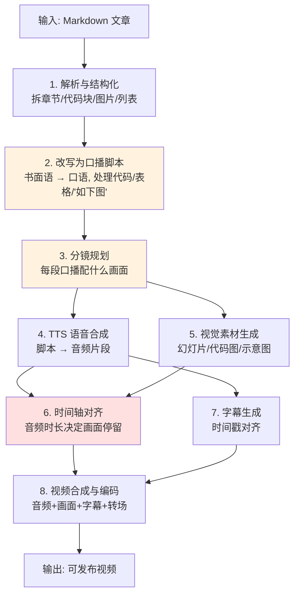

# 文章转视频 Pipeline —— 设计总览(讨论稿)

> 这是一份**讨论用的工作文档**,不是最终交付物。它的作用是给后续每一轮讨论提供锚点:管线整体长什么样、有哪些还没拍板的决策点。等某个模块讨论收敛,再把结论固化进 `requirements.md`(整体架构、输入输出、场景类型、错误处理)和 `technical-design.md`(技术选型、数据结构、集成方式)。
>
> 状态约定:🔲 待决策 / ✅ 已定 / ⚠️ 待验证(涉及外部库或 API,需查证后再下结论)。

## 这个工具的本质

表面是格式转换(Markdown → 视频),实质是跨越三种媒介的连续转换:

**为阅读而写的文字 → 为听觉而组织的口播 → 为观看而编排的画面**

每一次跨越都不是无损的,真正的设计难点都藏在这些转换里,而不在"格式"本身。

## 决策快照

| 编号 | 决策项 | 结论 |
|------|--------|------|
| 输出 | 视频时长 | ≤ 5 分钟(口播约 1200~1500 字) |
| D1 | 成片形态 | 程序化幻灯片 / 动态图形(Remotion 渲染) |
| D2 | 改写策略 | 适当改编 |
| D3 | 时间轴对齐 | 画面定内容 + 音频定时长(混合模式) |
| D4 | 技术选型 | Remotion(视频合成层);TTS / 解析库等待定 |
| D5 | 自动化 / 检查点 | 方案 B——脚本+分镜处设单一人工检查点,放行后全程无人值守 |

## 管线全景

橙色两步(改写、分镜)是 AI 创造价值最大的环节;红色的对齐步骤是整个架构最容易翻车的环节。

## 各步骤简述

1. **解析与结构化**:把 Markdown 拆成结构化数据——章节层级、正文、代码块、图片、表格、列表分别识别出来,作为后续处理的输入。
2. **改写为口播脚本**:核心 AI 步骤。把书面语改写成能"听懂"的口语,并决定代码/表格/"如上图所示"这类只能看不能听的内容怎么处理。
3. **分镜规划**:为每段口播决定画面内容。这一步的策略强依赖于"视频成片形态"这个总开关(见下方决策点 D1)。
4. **TTS 语音合成**:脚本 → 音频片段。注意 TTS 普遍按字符计费,成本和"增量重跑"策略相关(见 D5)。
5. **视觉素材生成**:生成每个分镜的实际画面(幻灯片、代码图、示意图等),形态由 D1 决定。
6. **时间轴对齐**:把变长的音频和画面停留时间对齐,是架构核心难点(见 D3)。
7. **字幕生成**:按时间戳对齐生成字幕,通常是 TTS 或强制对齐的副产物。
8. **视频合成与编码**:音频 + 画面 + 字幕 + 转场合成最终成片,输出目标平台所需格式。

## 输出约束(已定)

- **单条视频时长 ≤ 5 分钟。** 中文口播约 4~5 字/秒,5 分钟上限对应口播稿约 1200~1500 字。这意味着:面对长技术文章,改写阶段(D2)需要**大幅压缩**,而非逐段转述;超长文章是否拆成多条视频,是 D2 要一并解决的问题。

## 待决策点(本阶段的讨论清单)

下面是我认为会决定整个架构走向、需要逐个拍板的判断。依赖关系:**D1 是总开关**,定了之后 D2、D4 才有约束;D3 可单独深挖。

### D1 — 视频成片形态(总开关) ✅(程序化幻灯片 / 动态图形)

> **决定:程序化渲染的幻灯片 / 动态图形。** 用 Remotion 以 React 组件渲染每一帧——文字、要点、代码片段、示意图分页呈现,配转场动画。不走"数字人口播"和"屏幕录屏"路线。

"可发布的视频"到底长什么样,目前是最大的空白。至少四种典型形态,下游管线**几乎没有共同代码**:

| 形态 | 画面主体 | 与 TS 背景契合度 | 备注 |
|------|---------|----------------|------|
| 幻灯片式讲解 | 文字/要点/图示分页 | 高(Remotion/HTML) | 类似会议 talk |
| 代码走读录屏 | 代码编辑器 + 高亮 | 中 | 适合纯代码类文章 |
| 数字人口播 | 虚拟人物 + 字幕 | 低(依赖外部服务) | 需接 HeyGen 等 |
| 动态图形 | 纯 motion graphics | 中高 | 制作成本高 |

> 这一项定了,D2(分镜策略)和 D4(技术选型)的讨论才有地基。**建议优先讨论。**

### D2 — 改写策略:忠实还是改编 ✅

> **决定:适当改编**——介于"逐字忠实"和"自由创作"之间。具体边界(代码块处理粒度、可压缩到什么程度、超长文章是否拆条)留待 D2 专题细化。

AI 改写口播稿时,对原文的"忠实度"取多少?代码块逐行讲还是一句带过?表格转要点还是做成画面?需要明确边界。

### D3 — 时间轴对齐 ✅(混合模式)

> **决定:画面定内容 + 音频定时长。** 先规划分镜画面(由内容主导视频长什么样),再逐段 TTS,用每段音频的真实时长来设定该分镜的停留时间(+留白)。这样既能自主编排画面,又避免"音频塞不进固定时长"的麻烦。Remotion 按音频时长动态设定每段时长的具体 API ⚠️ 待验证。

音频时长在 TTS 跑完前未知,但画面停留必须匹配音频。两条路:

- **音频驱动**:先合成音频拿到真实时长,画面再去适配。
- **画面驱动**:先定每页停留时间,反过来约束口播字数。

这个选择会渗透到每一步的数据结构设计。

### D4 — 技术选型:Remotion ✅(能力边界 ⚠️ 待验证)

> **决定:用 Remotion** 做视频合成——React 组件定义每一帧,贴合 TS 背景。其能力边界与商用授权仍 ⚠️ 待验证。

前端 / TypeScript 背景在这里是强杠杆。[Remotion](https://www.remotion.dev/) 用 React 组件定义视频每一帧,学习成本低,天然适配"幻灯片式"。但其能力边界和商用授权**待验证**。视频合成层的备选还有 ffmpeg(更底层)等。等 D1 定了再展开。

### D5 — 人工介入点 + 增量重跑 ✅(方案 B:单一检查点)

> **决定:前半段半自动 + 后半段全自动。** 在"口播稿 + 分镜方案"(纯文本产物)处设**唯一人工检查点**,卡在 TTS 之前——这步 AI 判断最多、改起来最便宜、且在烧钱步骤之前。审过放行后,TTS → 素材渲染 → 视频合成全程无人值守。

可选的第二道轻检查点(方案 C,本期暂不做):TTS 出来后、渲染前听一遍音频,拦截技术术语读错(如 Remotion / nginx / K8s 这类,看文本发现不了、只能听出来)。先按 B 落地,第二道关按需再加。

架构含义:检查点要求每步中间产物落盘(结构化内容、脚本、分镜、各段音频……),从而支持**增量重跑**——改一句话只重跑受影响的那段 TTS 和渲染,而非全量重来。检查点与增量重跑,是同一个分阶段管线设计的两面。

## 下一步

D1~D5 全部拍板,**管线骨架已稳定**。场景类型、错误处理、文件组织已讨论完毕,正式规格已固化进 **`requirements.md`**。

偏实现的一层已固化进 **`technical-design.md`**:技术选型(LLM 用 Claude、TTS 用 ElevenLabs `with-timestamps`、Shiki、Remotion 编程式渲染、ffmpeg 拼接)、`Scene` 可辨识联合与双路哈希、各步集成方式。关键 ⚠️ 项已联网核实:ElevenLabs 时间戳接口、中文模型、Remotion API 均已确认;中文术语纠音改用别名替换;Remotion 渲染需串行/限并发。

三份文档已成体系:`design-overview`(决策与理由)→ `requirements`(需求规格)→ `technical-design`(实现方案),3.2 初始化与 3.3 编码可直接参考。
