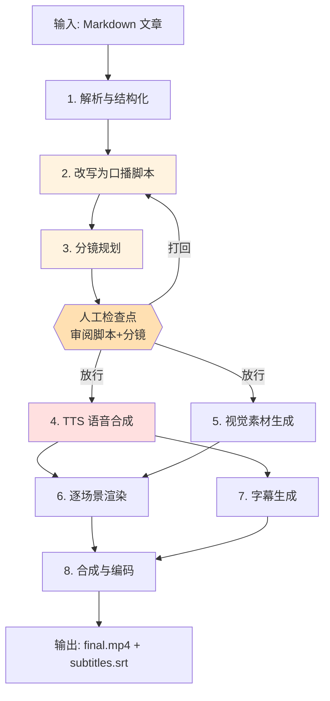

# 文章转视频 Pipeline —— 需求说明

## 文档说明

这是正式的需求规格,供 3.3 编码阶段直接参考。

输入是一篇技术文章(Markdown),输出是一条不超过 5 分钟、可直接发布的视频(mp4)。整体决策的推导过程与理由记录在 `design-overview.md`(D1~D5),本文是其正式化结果;偏实现的技术细节(数据结构定义、外部 API 集成方式)放在配套的 `technical-design.md`。

标注约定:⚠️ 表示涉及外部库/API、需在编码前查证的点。

## 核心约束

| 项 | 结论 |
|----|------|
| 视频时长 | ≤ 5 分钟(中文口播约 4~5 字/秒,对应口播稿约 1200~1500 字) |
| 画幅/规格 | 横屏 16:9,1920×1080,30fps |
| 成片形态 | 程序化幻灯片 / 动态图形,用 Remotion 以 React 组件渲染 |
| 改写策略 | 适当改编(介于逐字忠实与自由创作之间) |
| 时间轴 | 画面定内容 + 音频定时长(混合模式) |
| 视频合成 | Remotion |
| TTS | ElevenLabs(中文走多语言模型)⚠️ |
| 字幕 | 外挂 `subtitles.srt`,不烧录进画面 |
| 自动化 | 半自动:脚本+分镜处设单一人工检查点,放行后全程无人值守 |

## 输出规格

- 画幅 16:9 横屏,分辨率 1920×1080,帧率 30fps。
- 容器与编码:mp4(H.264 视频 + AAC 音频)⚠️(具体编码参数待验证)。
- 交付物为 `final.mp4` + `subtitles.srt` 两份文件——字幕外挂、不烧录进画面,因此修改字幕无需重新渲染视频。

## 整体架构

管线分为八步,以"脚本+分镜"产物处的人工检查点为界,前半段半自动、后半段全自动。



检查点卡在 TTS 之前,是因为脚本+分镜是判断密集、改起来最便宜、且在烧钱步骤之前的环节。审过放行后,TTS、素材、渲染、合成全程无人值守。被打回时回到第 2 步重写。

审阅的具体方式是直接编辑 `02-script.json`——修改口播文本、调整分镜、增删场景,改完重新运行 pipeline,断点续跑保证只重跑受影响的场景。这要求 `02-script.json` 人类可读可编辑:字段命名清晰、格式友好。

## 各步骤输入输出

| 步骤 | 输入 | 产物 | 性质 |
|------|------|------|------|
| 1 解析与结构化 | 文章 Markdown | `01-parsed.json`(章节/正文/代码块/图片/列表) | 自动,确定性 |
| 2 改写口播脚本 | `01-parsed.json` | 各场景的口播文本 + 预估时长 | 自动,AI 判断 |
| 3 分镜规划 | 脚本 | `02-script.json`(场景类型 + 可视字段 + 口播) | 自动,AI 判断 |
| — 人工检查点 | `02-script.json` | 审阅/修改后放行 | **人工** |
| 4 TTS 合成 | 各场景口播文本 | `audio/scene-XXX.mp3` + 时间戳 ⚠️ | 自动,**计费** |
| 5 视觉素材生成 | 分镜可视字段 | 代码图、文章配图等素材 | 自动 |
| 6 逐场景渲染 | 分镜 + 音频 + 素材 | `clips/scene-XXX.mp4` | 自动,**耗时** |
| 7 字幕生成 | TTS 时间戳/对齐 ⚠️ | `subtitles.srt` | 自动 |
| 8 合成与编码 | 各场景 clip + 字幕 | `final.mp4` | 自动 |

第 4 步若拿得到 ElevenLabs 的字符级时间戳 ⚠️,第 7 步字幕几乎是其副产物,无需单独做强制对齐。第 5 步视觉素材生成不依赖音频,可与第 4 步 TTS 并行。字幕以外挂 `subtitles.srt` 交付,第 8 步合成不烧录字幕。

## 场景类型

技术文章的画面归为四类。每类的口播文本(narration)是它与 TTS 的接口,落盘后按场景独立合成。

- **标题卡(title)**:章节标题/封面。可能没有口播(静音),此时时长纯由动画决定。
- **纯旁白(narration)**:旁白为主,屏幕上配要点文字(bullets)。
- **代码展示(code)**:展示代码片段,支持语法高亮、行高亮。短代码静态展示;长代码用**滚动动画**(代码随讲解向上滚动)。滚动时长构成该场景的"最短动画时长",参与时间轴的 `max()` 托底。滚动动画是已知较复杂的实现项 ⚠️,具体实现与渲染性能留 `technical-design.md`。
- **配图(image)**:画面以图为主。**MVP 阶段图源只支持"文章自带图"**(Markdown 里的 ``)。AI 生成图、图表渲染(如 Mermaid)、视频生成均为后续扩展——视觉来源设计成可插拔接口,现在不实现。

## 时间轴规则

预估时长和实际时长用途不同,不需要相互对齐:

- **预估时长**只用于发车前的预算检查——脚本生成后、TTS 之前,粗算全片会不会超 5 分钟,超了就提示回去砍稿。只要够准到能判断超时即可。
- **实际时长**是渲染时的唯一真相,由 TTS 产物量得。

每个场景的最终时长按下式计算,音频驱动但被动画下限托底:

```
场景时长 = max(音频时长, 该场景最短动画时长) + 留白
```

代码滚动、标题卡入场动画等都会产生"最短动画时长";静音的标题卡则纯由动画决定时长。

所有时长以秒计,渲染时按 30fps 换算成帧:`durationInFrames = ceil(场景时长秒 × 30)`。"留白"默认取 0.3~0.5 秒,为可配置项。

## 内容处理规则

解析(第 1 步)与改写(第 2 步)对 Markdown 中的特殊元素按以下规则处理:

- 行内链接:口播去除 URL、保留锚文本;画面按需显示文字。
- 代码块:进入 code 场景(短码静态、长码滚动)。
- 文章图片(``):进入 image 场景。
- 表格:转为要点口播,画面以简化要点呈现,复杂表格降级处理。
- 嵌套列表 / 引用块:并入对应 narration 场景的要点(bullets)。
- 数学公式(LaTeX):MVP 暂不支持,遇到时在口播中以文字描述代替或跳过;渲染为图片后作 image 场景列为后续扩展。

## 错误处理与边界

### 断点续跑

TTS 计费、渲染耗时,整条重跑代价高。解决思路是**让每一步幂等 + 内容寻址**:每步产物写盘,`state.json` 记录每份输入已完成到哪一步及其内容哈希。重跑时,产物已存在且输入哈希未变的步骤直接跳过,从失败点续上。

粒度上,TTS 与渲染都**按场景**进行:某段音频或某段 clip 失败,只续那一段;改动一句口播,只有哈希变化的那段重新 TTS 和重渲。渲染采用"逐场景出 clip + ffmpeg 拼接",而非整条一次渲染。代价是跨场景转场较难——MVP 阶段每段自带淡入淡出后硬拼接,真正的跨场景转场列为后续。

### 超长文章

文章口播超过 1500 字(约 5 分钟上限)时,在改写阶段(第 2 步)处理,而非任由其超时。第一版策略:**改写时按 5 分钟预算大幅压缩**,并在预算检查超标时提示。是否支持"自动拆成多条视频"列为后续扩展。

### 视觉素材降级(B-roll)

不引入视频生成。需要动态视觉的场景**降级为静图 + 缓慢推拉(Ken Burns)+ 屏幕文字**,图源优先用文章自带图。对技术文章而言,代码、图示、要点比空镜头更有效,降级不损害内容质量。视频/图像生成接口预留但不实现。

### 多任务隔离

一篇文章对应一个独立 job 目录,彼此隔离,天然支持并行,不会互相污染。并行的真实约束不在文件层,而在共享资源——ElevenLabs 并发额度、渲染占用的 CPU。因此"多篇同时处理"实质是"多个 job 目录 + 一个受并发上限约束的调度"。

### AI 输出校验与重试

断点续跑解决的是崩溃恢复,但第 2、3 步的 LLM 输出还可能格式非法或不合 schema。这两步的产物必须经 schema 校验(如 JSON Schema / zod),不通过则自动重试若干次;仍失败则停在该步报错,不进入人工检查点。

### 字幕时间戳 fallback

第 7 步优先使用 ElevenLabs 的字符级时间戳 ⚠️。若该接口不可用,降级为用 Whisper 等做强制对齐;再不行则按各场景音频时长粗略均分。三级降级保证字幕始终能产出。

## 产物文件组织

```
output/
  <job-id>/                # job-id = 日期-文章slug(中文标题转拼音或加哈希后缀,保证文件名安全)
    source.md              # 输入文章副本
    01-parsed.json         # 结构化内容
    02-script.json         # 脚本 + 分镜(人工审阅对象)
    audio/
      scene-001.mp3        # 逐场景音频
      ...
    clips/
      scene-001.mp4        # 逐场景渲染片段
      ...
    subtitles.srt
    final.mp4              # 最终成片
    state.json             # 进度 + 输入哈希清单(断点续跑依据)
```

## 统一视觉主题与配置项

成片需采用统一的视觉主题(配色、字体、版式),保证各场景观感一致、像一个完整作品;主题的具体设计留 `technical-design.md`。

可配置项便于不同文章或风格复用:TTS 的 voice 与语速、场景留白时长、输出目录等(分辨率与帧率已默认 1080p/30fps)。配置文件格式留 `technical-design.md`。

技术文章口播常含中英混排(大量英文术语),其朗读质量需重点关注;术语纠音靠别名替换处理,中文不支持音素级发音词典。

## MVP 范围

| 纳入 MVP | 列为后续扩展 |
|----------|--------------|
| 单篇文章 → 单条 ≤5min 视频 | 超长文章自动拆条 |
| 四类场景:标题卡/纯旁白/代码/配图 | AI 生成图、图表(Mermaid)渲染 |
| 配图仅用文章自带图 | 视频生成(B-roll) |
| 脚本+分镜单一人工检查点 | TTS 后听音频的第二道检查点 |
| 逐场景渲染 + 硬拼接(段内淡入淡出) | 跨场景转场动画 |
| 横屏 16:9 / 1080p / 30fps | 竖屏 9:16 画幅 |
| 外挂 .srt 字幕 | 硬字幕烧录进画面 |
| 长代码滚动动画展示 | 数学公式(LaTeX)渲染 |
| 编辑 JSON 重跑式检查点 | CLI 交互式检查点 |
| 断点续跑 + 增量重跑 | — |

## 明确不在范围内

以下能力 MVP 不做,避免范围歧义:背景音乐与音效、封面/缩略图生成、自动上传发布、TTS 成本上限保护(可选,后续考虑)。输入仅接受本地 `.md` 文件路径,工具以命令行(CLI)形式运行。

## 待验证清单(编码前查证)

- ✅ ElevenLabs 中文用 `eleven_multilingual_v2`(默认)/ `eleven_v3`;术语纠音用别名替换(中文不支持音素级发音词典)。详见 `technical-design.md`。
- ✅ ElevenLabs `with-timestamps` 接口返回字符级时间戳,字幕由其生成,无需单独强制对齐。详见 `technical-design.md`。
- ✅ Remotion `bundle()`/`selectComposition()`/`renderMedia()`/`calculateMetadata` 已确认,编程式渲染无需开发服务器。详见 `technical-design.md`。
- ⚠️ 逐场景 clip 用 ffmpeg 拼接时的编码参数一致性要求。
- ⚠️ 中英混排口播的 TTS 朗读质量与英文术语读法。
- ⚠️ code 场景滚动动画的实现方式与渲染性能。
- ⚠️ 字幕时间戳 fallback 中 Whisper 强制对齐的可行性与精度。
- ⚠️ mp4 输出的 H.264 / AAC 编码参数(码率、profile 等)。
