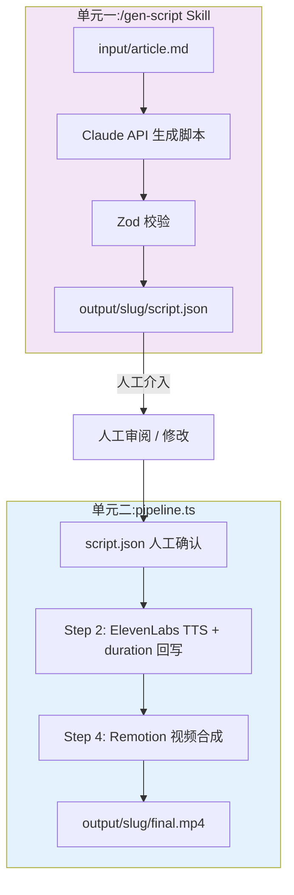
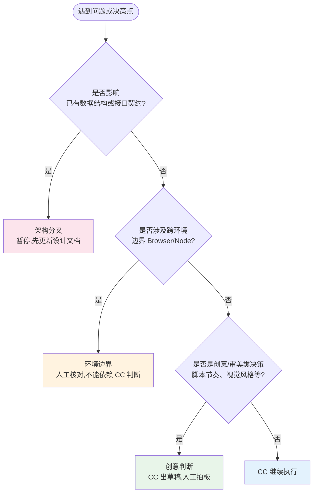

# 3-3 文章转视频 Pipeline（第 3 章贯穿案例 · 编码阶段现场演示工程）

第 3 章贯穿案例工程的 **3.3 编码阶段**起点。配套讲义见 [`handout/3-cc-driven-development/3-3-coding-phase-handout.md`](../../handout/3-cc-driven-development/3-3-coding-phase-handout.md)。

设计文档落地、CLAUDE.md 配好、Skills 到位——这才是写代码的起点。本阶段的任务,是把设计文档里的方案变成可运行的代码。

## 输入:3.2 初始化阶段的产出

本工程直接继承自 [`demos/3-2-article-to-video`](../3-2-article-to-video) 的初始化阶段产出,以下都已就位:

```
3-3-article-to-video/
├── CLAUDE.md                 # 提炼好的项目 CLAUDE.md（技术栈、硬约束、目录结构、编码规范）
├── docs/                     # 3.1 设计阶段的三份文档（只读上下文）
│   ├── requirements.md
│   ├── technical-design.md
│   └── design-overview.md
├── .agents/skills/           # find-skills 选型后安装的社区 Skills
│   ├── remotion-best-practices/    # Remotion 渲染最佳实践
│   ├── text-to-speech/             # ElevenLabs TTS
│   ├── typescript-react-reviewer/  # 代码审查
│   ├── typescript-advanced-types/
│   └── skill-creator/
├── skills-lock.json          # Skills 安装锁文件
├── .claude/
│   ├── settings.json         # permissions.deny
│   ├── settings.local.json   # Skill 授权
│   └── skills/               # 指向 .agents/skills/ 的软链
├── input/react-compiler.md   # 演示用样例文章（/gen-script 的输入）
└── package.json              # 占位,依赖由 CC 搭骨架时补全
```

源码（`src/`）、`tsconfig.json`、依赖安装、`/gen-script` Skill 都还不存在——它们是本阶段的产出。

## 本阶段产出

| 产出物 | 怎么来的 |
|--------|----------|
| `src/` 全套骨架 + 实现 | CC 读设计文档搭骨架,逐步骤填实现 |
| `src/schema.ts`（对齐后的 Zod schema） | CC 列歧义字段,人工拍板 |
| `.claude/skills/gen-script/` | 让 CC 根据脚本格式定义写出来 |
| `package.json` 依赖 + `tsconfig.json` | 搭骨架时一并生成 |

## Pipeline 架构

整个系统分成两个独立单元,通过 `script.json` 文件交接,中间留出人工审阅的空间:



## 怎么开始演示

在本目录打开 Claude Code,按讲义依次推进。注意每个 prompt 都很短——细节都在 `docs/` 和 `CLAUDE.md` 里,CC 会自己去读。

**第一步:搭骨架,让项目先跑起来。** 第一个任务不是"实现 TTS",而是搭出可运行的框架:

> 读 docs/requirements.md 和 docs/technical-design.md，按照文档里的设计搭出项目骨架。
> 各步骤的具体逻辑先不用实现,占位即可。
> 用 npx tsx 直接运行 TypeScript 源码,不需要编译步骤。
> TypeScript 和 ESLint 配好,目标是骨架能跑起来不报错。

验收标准:TypeScript 编译通过,CLI 能接受参数并输出"step N skipped"之类的占位日志。

**第二步:架构先行,先对齐 Schema。** 跨模块的数据接口必须人工对齐——`/gen-script` 写入、`pipeline.ts` 读取同一份 `script.json`,字段的 required/optional、duration 的秒/帧,定错了运行时才会以 NaN 之类的形式爆出来:

> 读 technical-design.md 里的数据结构定义,检查骨架里的 Schema 是否完整覆盖。
> 对每个有歧义的字段,列出可选的设计方案和各自的影响,让我来决定。

让 CC 列选项、分析 trade-off,最终拍板必须是人。

**第三步:逐步骤填实现,说目标就够了。** 结构定完后,prompt 可以写得出奇地短:

> 实现 TTS 这一步。参考 technical-design.md 里的步骤定义,
> 记得处理 duration 回写,让 Step 4 拿到的是实际音频时长。

文件路径、API 选型、并发控制、断点续跑这些细节都在设计文档里,CC 自己会去读。

**第四步:写 /gen-script Skill,交互式迭代脚本。** 先让 CC 写出 Skill 本身:

> 根据 technical-design.md 里的脚本格式定义,写一个 /gen-script Skill。
> 功能:接收一篇 Markdown 文章路径,生成视频分镜脚本,
> 和用户交互确认后输出 script.json。
> 场景类型划分规则要具体,duration 估算要有明确假设,
> 输出要符合 src/schema.ts 里的 ScriptSchema。

然后用样例文章跑一遍,用自然语言反馈直到满意:

```
/gen-script input/react-compiler.md
```

脚本是创意产物,节奏感和场景划分没有客观对错——这个环节是整条 pipeline 里人工介入最密集的地方,也应该是。

**第五步:/code-review 做第一次审查。** 两个单元实现成形后,跑集成测试之前先用审查 Skill 过一遍。Skill 把检查维度和报告格式固化了,比临时问"帮我 review"更可预期,也让 CC 切换到旁观视角。注意它发现不了 Remotion 的浏览器/Node 环境边界这类领域约束,那部分仍需人工对照文档判断。

## 人工介入的三个判断点

CC 执行效率很高,但有三类判断的依据在 CC 之外,遇到时要暂停:



## 工程链路

| 阶段 | 在本工程里发生什么 |
|------|--------------------|
| 3.1 设计 | 多轮对话 → 产出 `docs/requirements.md`、`docs/technical-design.md`（见 3-1） |
| 3.2 初始化 | 提炼 `CLAUDE.md`、find-skills 选型 Skills（见 3-2） |
| **3.3 编码** | **搭骨架 → 对齐 Schema → 逐步骤实现 → 写 `/gen-script` → `/code-review`（本工程）** |
| 3.4~3.6 | 调试、自举循环、复盘 |

> 已完成的参考实现见 [`demos/3-0-article-to-video`](../3-0-article-to-video)（含完整 `src/`、`.claude/skills/gen-script`）。演示前别提前翻,避免剧透实现细节。
