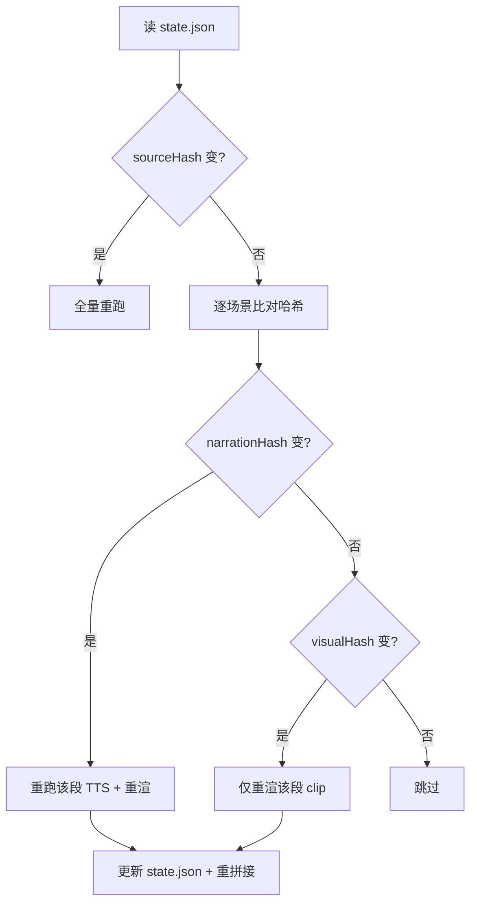

# 文章转视频 Pipeline —— 技术设计

## 文档说明

本文承接 `requirements.md`(需求规格)与 `design-overview.md`(决策推导),落实三件事:技术选型、关键数据结构、关键集成方式。需求层已锁定的约束(横屏 1080p/30fps、混合时间轴、外挂 srt、单一人工检查点、断点续跑)在此不再重复,只补实现方案。

标注约定:✅ 已查证;⚠️ 仍待编码前验证。涉及外部 API 的结论附了官方文档链接。

## 技术选型

| 角色 | 选型 | 状态 | 说明 |
|------|------|------|------|
| 运行时 / 语言 | Node.js + TypeScript,CLI 入口 | ✅ | 贴合作者技术栈;CLI 形态见 requirements |
| Markdown 解析 | `unified` + `remark-parse`(mdast) | ✅ | TS 生态标准,产出结构化语法树供步骤 1 使用 |
| LLM(步骤 2/3) | Claude,`@anthropic-ai/sdk` | ✅ | 结构化输出 + 中文/代码理解;默认 `claude-opus-4-8` |
| 结构化输出 | `messages.parse()` + `zodOutputFormat` | ✅ | API 层保证 schema 合法,直接覆盖"AI 输出校验" |
| TTS | ElevenLabs `with-timestamps` 接口 | ✅ | 返回字符级时间戳,字幕白送 |
| 代码高亮 | Shiki(`react-shiki`)+ Shiki Magic Move | ✅ | Shiki 生成 token,滚动用 Remotion 驱动 |
| 视频合成 | Remotion(`@remotion/bundler` + `@remotion/renderer`) | ✅ | 编程式渲染,无需开发服务器 |
| 片段拼接 | ffmpeg(concat) | ⚠️ | 逐场景 clip 拼接,编码参数一致性待定 |
| 字幕 | 由 TTS 时间戳生成 SRT | ✅ | fallback:ElevenLabs Forced Alignment → Whisper |

LLM 模型默认用 `claude-opus-4-8`——步骤 2/3 是全流程质量最敏感的一步,值得用最强模型;若要降本,可在配置里切换到 `claude-sonnet-4-6`(同样支持结构化输出)。模型档位作为配置项,不写死。

## 关键数据结构

### Scene:可辨识联合

分镜的核心数据结构是一个按 `type` 区分的可辨识联合。它贯穿"脚本阶段(只有口播 + 可视字段)"和"TTS 后阶段(回填 audio)",靠可选字段渐进填充——这对个人工具足够,不必为每个阶段建独立类型。

```typescript
import { z } from "zod";

const SceneBase = z.object({
  id: z.string(),                 // 稳定 ID,增量重跑的 key
  narration: z.string(),          // 口播文本 → 喂给 TTS(可空,如静音标题卡)
  estimatedDuration: z.number(),  // 预估秒数,仅发车前预算检查用
});

const TitleScene = SceneBase.extend({
  type: z.literal("title"),
  title: z.string(),
  subtitle: z.string().optional(),
});
const NarrationScene = SceneBase.extend({
  type: z.literal("narration"),
  bullets: z.array(z.string()).optional(),  // 旁白时屏幕显示的要点
});
const CodeScene = SceneBase.extend({
  type: z.literal("code"),
  code: z.string(),
  language: z.string(),
  highlightLines: z.array(z.number()).optional(),
  scroll: z.boolean().default(false),        // 长代码滚动
});
const ImageScene = SceneBase.extend({
  type: z.literal("image"),
  imagePath: z.string(),          // MVP:仅文章自带图的本地路径
  caption: z.string().optional(),
});

export const SceneSchema = z.discriminatedUnion("type", [
  TitleScene, NarrationScene, CodeScene, ImageScene,
]);
export const ScriptSchema = z.object({ scenes: z.array(SceneSchema) });
```

`ScriptSchema` 同时是**步骤 2/3 的 LLM 结构化输出 schema** 和**人工检查点编辑的 `02-script.json`**。用同一份 Zod schema 约束 AI 产物和人工编辑结果,两端校验一致。

### 阶段产物的渐进增强

TTS 后,每个场景回填一个 `audio` 字段;它不进 LLM schema(避免 AI 编造),由 TTS 阶段写入:

```typescript
interface SceneAudio {
  path: string;            // audio/scene-XXX.mp3(dry-run 为空串)
  durationSec: number;     // 取 alignment 末值(≈总时长,规避 ffprobe),渲染时长的真相
  alignment: CharAlignment; // ElevenLabs 字符时间戳,做字幕用
}
// 实现落地:audio 不进 02-script.json,落 sidecar `audio/scene-XXX.json`(随 scene.id 失效)。
type EnrichedScene = z.infer<typeof SceneSchema> & {
  audio?: SceneAudio;
  minAnimDurationSec?: number;  // 动画下限(如代码滚动),参与 max() 托底
};
```

### state.json:断点续跑的依据

每个 job 目录下的进度清单。每步幂等、内容寻址——重跑时对比哈希决定跳过还是重做:

```typescript
interface JobState {
  jobId: string;
  sourceHash: string;                  // 输入文章哈希
  stages: {
    parsed?: { done: boolean; hash: string };
    script?: { done: boolean; hash: string };
  };
  scenes: Record<string, {             // 按 scene id
    narrationHash: string;             // 变 → 重跑 TTS
    visualHash: string;                // 变 → 重渲该 clip
    audioDone: boolean;
    clipDone: boolean;
  }>;
}
```

哈希分两路是关键:`narrationHash` 只看口播文本,决定要不要重新烧 TTS 的钱;`visualHash` 看可视字段(code/bullets/image…),决定要不要重渲该片段。改一句口播只触发那一段的 TTS + 重渲,不波及画面没变的场景。

## 关键集成方式

### Claude:步骤 2/3 的改写与分镜

> 实现订正:编码时核实**已装的 `@anthropic-ai/sdk@0.65.0` 没有 `messages.parse()`,`@anthropic-ai/sdk/helpers/zod` 也不导出 `zodOutputFormat`**(只有 `betaZodTool`)。改用底层 `messages.create` 的 `output_config.format`(json_schema)+ 手动校验。差异封死在 `src/integrations/claude.ts`,上层无感。

用 `messages.create` 传 `output_config.format`(type `json_schema`)强制模型返回 JSON,schema 由 `zod-to-json-schema` 从 `ScriptSchema` 转出;再手动 `JSON.parse` + `ScriptSchema.safeParse` 校验,不合则 `RetryableError` 重试——真正的校验器是 zod,同样实现 requirements 里的"schema 校验 + 重试":

```typescript
import Anthropic from "@anthropic-ai/sdk";
import { zodToJsonSchema } from "zod-to-json-schema";

const client = new Anthropic();
const jsonSchema = zodToJsonSchema(ScriptSchema, { $refStrategy: "none" });
const body = {
  model: "claude-opus-4-8",          // 或配置为 claude-sonnet-4-6 降本
  max_tokens: 16000,
  thinking: { type: "adaptive" },     // Opus 4.8 仅支持自适应思考
  system: REWRITE_SYSTEM_PROMPT,      // 含"适当改编 + 5min 预算 + 中英混排"约束
  messages: [{ role: "user", content: parsedArticleJson }],
  output_config: { format: { type: "json_schema", schema: jsonSchema } },
};
// 0.65.0 类型未覆盖 output_config/adaptive,运行时支持,双重断言透传
const res = await client.messages.create(
  body as unknown as Anthropic.MessageCreateParamsNonStreaming,
);
const text = res.content.filter((b) => b.type === "text").map((b) => b.text).join("");
const parsed = ScriptSchema.safeParse(JSON.parse(text));
if (!parsed.success) throw new RetryableError("schema 不合法");
const script = parsed.data;            // 合法的 { scenes: [...] }
```

注意 Opus 4.8/Sonnet 4.6 不再支持 `temperature`/`budget_tokens`,用 `thinking: {type:"adaptive"}` 控制思考。`id`/`scroll`/`estimatedDuration` 由 pipeline 派生,prompt 要求 LLM 不产出;即便产出,`enrichScript` 也覆盖重算。参考 [结构化输出](https://platform.claude.com/docs/en/build-with-claude/structured-outputs.md)、[模型选择](https://platform.claude.com/docs/en/about-claude/models/overview.md)。

### ElevenLabs:逐场景 TTS + 字幕时间戳

按场景逐段调 `with-timestamps` 接口(支撑增量重跑),拿到音频 + 字符级对齐:

```
POST /v1/text-to-speech/{voice_id}/with-timestamps
body: { text, model_id: "eleven_multilingual_v2", output_format: "mp3_44100_128" }
→ { audio_base64, alignment: { characters[], character_start_times_seconds[], character_end_times_seconds[] } }
```

默认模型 `eleven_multilingual_v2`(生产级、稳定可复现,适合自动化);追求表现力可切 `eleven_v3` ⚠️(官方建议多次生成择优,自动化场景需评估稳定性)。术语纠音用**别名替换**——ElevenLabs 的发音词典只支持 IPA/CMU 音素、面向英文,中文不支持音素级纠正,只能在送 TTS 前把易读错的词替换成更易读的文本。参考 [Create speech with timing](https://elevenlabs.io/docs/api-reference/text-to-speech/convert-with-timestamps)、[Models](https://elevenlabs.io/docs/overview/models)。

字幕由 `alignment` 的字符时间戳聚合成词/句级 cue,再写成 SRT——无需单独的强制对齐模块。fallback 链:接口不可用 → ElevenLabs 独立的 Forced Alignment 接口 → Whisper ⚠️。ElevenLabs JS SDK 的具体方法名 ⚠️ 编码时核对,REST 形状如上已确认。

### Remotion:逐场景渲染

渲染走编程式 API,**不需要开发服务器**(Studio 只用于开发时调组件)。`bundle()` 打包一次、缓存复用;每个场景作为一个 composition,`calculateMetadata()` 根据 inputProps 里的音频时长动态算 `durationInFrames`,落实混合模式:

```typescript
import { bundle } from "@remotion/bundler";
import { selectComposition, renderMedia } from "@remotion/renderer";

const serveUrl = await bundle({ entryPoint: "./remotion/index.ts" });  // 缓存复用
for (const scene of scenes) {
  const inputProps = { scene, audioDurationSec: scene.audio!.durationSec };
  const composition = await selectComposition({ serveUrl, id: "Scene", inputProps });
  await renderMedia({
    composition, serveUrl, codec: "h264",
    outputLocation: `clips/${scene.id}.mp4`, inputProps,  // 与 selectComposition 同一份 inputProps
  });
}
```

`calculateMetadata` 里按 `max(音频时长, 动画下限) + 留白` 换算成帧(`ceil(秒 × 30)`)。**关键约束**:官方明确"不建议同时渲染多个视频,单个渲染就吃满机器资源"——所以逐场景 clip **串行渲染**,多 job 并行也要严格限并发,这修正了 requirements 里"并行"的乐观假设。代码场景的滚动用 `useCurrentFrame()` + `interpolate()` 驱动 `translateY`(而非 CSS 滚动,保证逐帧确定性),Shiki highlighter 需预加载/缓存以避免异步高亮导致的空帧 ⚠️。参考 [renderMedia](https://www.remotion.dev/docs/renderer/render-media)、[calculateMetadata](https://www.remotion.dev/docs/calculate-metadata)、[SSR Node 指南](https://www.remotion.dev/docs/ssr-node)。

音频时长在 pipeline 侧用 `ffprobe` 量取后写进 `scene.audio.durationSec`,再通过 inputProps 传给 Remotion——Remotion 只负责按这个数排版,不自己探测。

### ffmpeg:片段拼接

各场景 clip 渲染完后用 ffmpeg concat 成 `final.mp4`。前提是各 clip 编码参数一致(分辨率/帧率/编码器/像素格式),否则 concat 会失败或错位。具体参数组合 ⚠️ 编码时验证。MVP 阶段每段自带淡入淡出后硬拼接,不做跨场景转场。

## 断点续跑的实现

把每个 stage 写成幂等函数:执行前查 `state.json`,若产物已存在且输入哈希未变则跳过。粒度上 TTS 与渲染都按场景:



任一 stage 失败,已完成的产物留在盘上,重跑从失败点续上。人工检查点改 `02-script.json` 后重跑,同样靠这套哈希比对只动受影响的场景。

## 待验证清单(编码前)

- ✅ 已查证(本文已落实):ElevenLabs 时间戳接口、中文模型、Remotion 编程式 API、代码高亮方案。
- ⚠️ ElevenLabs JS SDK 的具体方法签名(REST 形状已确认)。
- ⚠️ `eleven_v3` 在自动化批量场景下的输出稳定性。
- ⚠️ ffmpeg concat 的编码参数一致性组合。
- ⚠️ Shiki 在 Remotion 逐帧渲染下的预加载/性能,及滚动动画的最短时长标定。
- ⚠️ Whisper fallback 强制对齐的可行性与精度(主路径 ElevenLabs 时间戳可用时通常用不到)。
