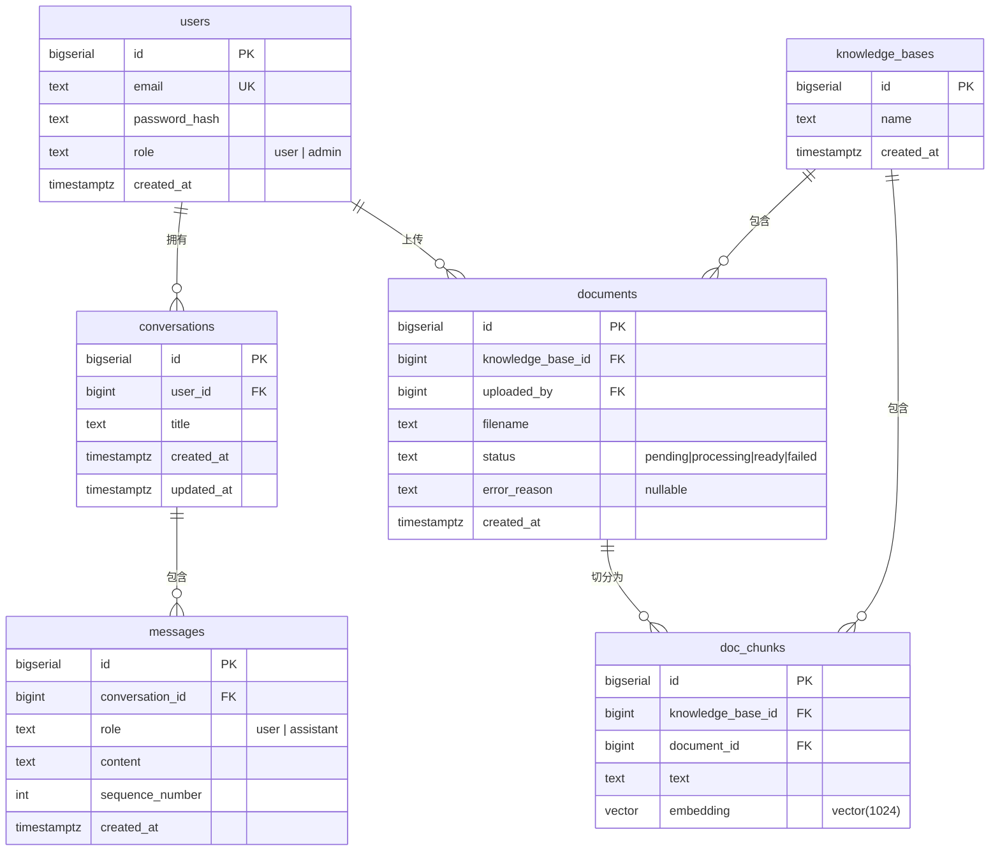
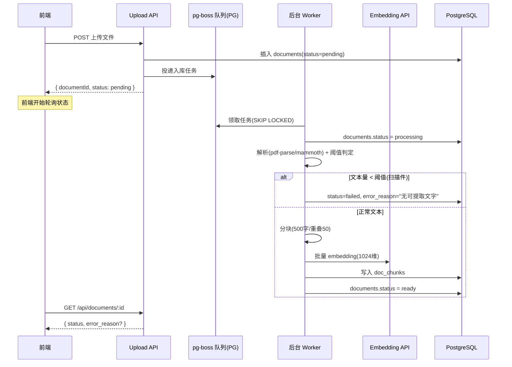
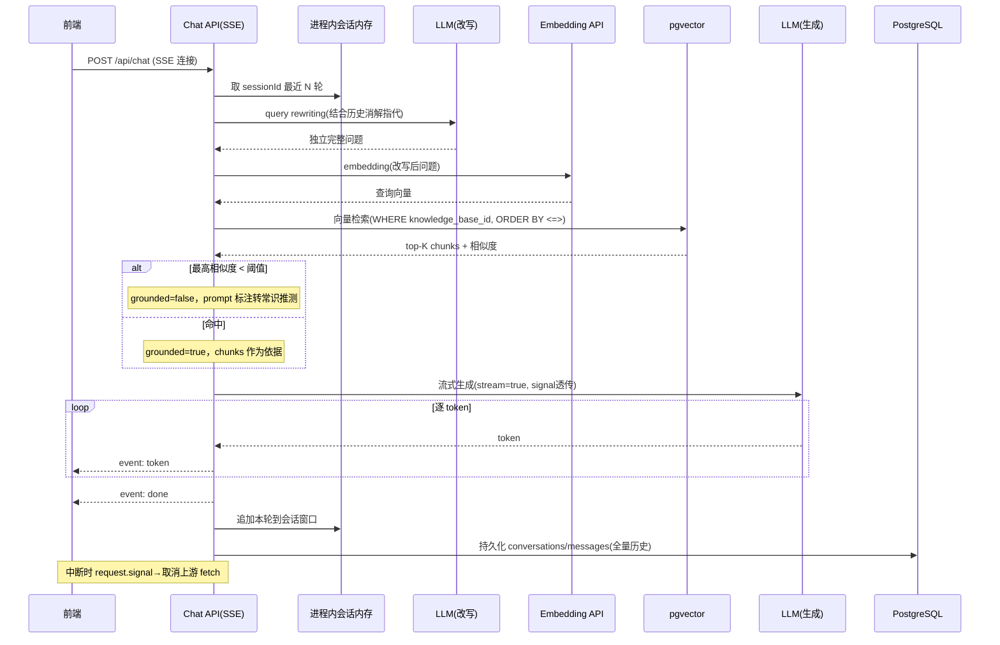

# 智能知识问答系统 架构设计

> 版本：v1.0　｜　状态：架构设计完成，待评审
>
> 输入：`requirements.md`（做什么）+ `tech-selection.md`（选什么技术）+ 本轮确认的运行时约束
>
> 输出：本文档（怎么落地）——面向落地，重表结构、接口契约、目录结构与工程落地要点。

## 一、输入、目标与技术栈变更

本文档承接两份上游产出：`requirements.md` 定义了六大功能与边界，`tech-selection.md` 给出了带约束推导的技术选型。本轮在架构设计阶段又新增了一组运行时约束，其中**后端从 Python + FastAPI 改为 Next.js API Routes**，这一变更推翻了选型文档里几个基于 Python 生态推导的结论，必须先说清楚。

### 1. 本轮新增的运行时约束

| 约束 | 取值 |
|------|------|
| 后端 | Next.js API Routes，**长驻 Node 单实例**（`next start`，非 serverless） |
| 前端 | React + TypeScript |
| 前后端通信 | SSE（延续选型决策点 1） |
| 团队 | 1 名全栈开发 |
| 用户场景 | 流式问答，用户可中途中断 |

### 2. 技术栈变更对选型文档的影响

Python → Node 的切换，使选型文档中三个决策点需要重定：

| 选型决策点 | 原结论（Python） | 重定后（Node）| 变更原因 |
|-----------|----------------|--------------|---------|
| 决策点 4 文档解析 | PyMuPDF + python-docx（AGPL 待评审） | `pdf-parse`(MIT) + `mammoth`(BSD) + `fs` | Python 库在 Node 运行时不可用；**AGPL 评审项随之作废** |
| 决策点 5 会话上下文 | 进程内内存（FastAPI 常驻进程） | **进程内内存依然成立** | 关键前提是"长驻 Node 单实例"，见决策 4 |
| 决策点 9/1 SSE 中断 | `request.is_disconnected()` 轮询 | `request.signal` 透传给上游 `fetch` | Node/Web 标准 API 与 Python 不同，机制等价 |

选型文档中未受影响、直接沿用的结论：**pgvector**（决策点 2）、**知识库字段过滤隔离**（决策点 3）、**query rewriting**（决策点 5B）、**PG 两表存历史**（决策点 6）、**LLM/Embedding 走云 API + 1024 维**（决策点 7）。

### 3. 需求微调点清单（评审重点）

架构决策过程中，有三处对需求原文做了解释性调整。这里显式列出，供评审时确认，而非悄悄抹平：

1. **扫描件拦截从"上传即时"改为"稍后状态告知"**（源自全异步入库，决策 2）。需求功能 2 原文是"上传环节即拦截"；全异步后，用户上传即得"已接收"，拦截结论在后台阈值判定后经轮询返回。拦截逻辑不丢，损失的是即时性体感。若评审认为即时性重要，可退回"同步快校验 + 异步慢入库"的两段式。
2. **知识库从"个人空间"改为"全员共享"**（决策 6）。需求功能 1 措辞"上传自己的文档"字面像个人空间，本架构理解为"任何人可建库、建的库全员可见，按主题而非按人分库"。`knowledge_bases` 表因此不含 `owner_user_id`。
3. **用户维度隔离退到历史记录层**。知识库全员平权后，用户之间的隔离只体现在历史记录：普通用户按 `user_id` 只看自己的对话，管理员全局可见（决策 7、8）。

---

## 二、架构决策记录（11 项）

每项按「决策 / 理由 / 代价 / 落地要点」组织。前 8 项为主干，后 3 项为关键细节。

### 决策 1：后端运行时——长驻 Node 单实例

- **决策**：Next.js API Routes 以 `next start` 跑在单个长驻 Node 进程上（VM / 容器 / Railway），Route Handler 显式声明 `runtime = "nodejs"`。
- **理由**：长驻进程让进程内会话内存与 SSE 长连接重新成立；DAU < 500 单实例容量充裕。
- **代价**：无冗余，进程重启 = 所有进行中的会话上下文清空。但这与需求"刷新即清"语义一致，本期可接受。
- **落地要点**：SSE Route Handler 必须设 `export const runtime = "nodejs"` 和 `export const dynamic = "force-dynamic"`，避免被当成静态路由或缓存。

### 决策 2：文档上传——全异步入库

- **决策**：上传接口立即返回"已接收 + 文档 ID"，解析、阈值判定、分块、embedding、写库全部丢到后台任务，前端轮询文档状态。
- **理由**：上传接口彻底不阻塞，统一走"提交 → 轮询状态"一条路径，实现与心智最简单。
- **代价**：扫描件拦截变为异步（见需求微调点 1）。
- **落地要点**：`documents` 表用 `status` 字段（`pending`/`processing`/`ready`/`failed`）驱动前端轮询；`failed` 时 `error_reason` 回显具体原因（满足需求"显示失败原因、不影响其他文档"）。

### 决策 3：后台任务调度——PostgreSQL 当队列（pg-boss）

- **决策**：用 `pg-boss` 把 PostgreSQL 作为任务队列，后台 worker 消费入库任务。
- **理由**：复用已有 PG，**守住"不引入 Redis"**；任务持久化，进程重启不丢任务。
- **代价**：比纯进程内任务多一层任务表与轮询逻辑。
- **落地要点**：`pg-boss` 已封装 `SELECT ... FOR UPDATE SKIP LOCKED` + 重试 + 调度，无需手写并发控制；worker 在 Node 进程启动时随应用一起 `boss.start()`。进程重启后 `pg-boss` 自动恢复未完成任务，同时 `documents.status = 'processing'` 的记录可作二次兜底扫描。

### 决策 4：会话上下文——进程内内存（滑动窗口）

- **决策**：`session_id` 索引一个进程内 Map，存最近 N 轮对话（N 为可调参数，默认 6 轮）。
- **理由**：需求"刷新/新开会话即清、不跨会话"恰好消解了持久化的唯一理由；单实例下 `session_id` 落点无歧义。
- **代价**：进程重启丢进行中上下文——与需求语义一致，非隐患。
- **落地要点**：需一个过期清理机制（如每个 session 记 `lastAccess`，定时清理超时会话）防止内存无限增长；这块内存**只服务上下文，绝不读历史表**（见决策 6 的读路径分离）。

### 决策 5：用户认证——Supabase Auth（托管身份）

> **变更（2026-09-09）**：认证方案由「自建账号 + 自签 JWT」改为 **Supabase Auth**。原自建方案的记录保留在本条末尾，便于回溯决策历史。

- **决策**：用 **Supabase Auth** 托管账号与登录态。邮箱 + 密码登录，session 存 httpOnly cookie，服务端用 `@supabase/ssr` 的 `createServerClient` 读取；授权决策一律走 `supabase.auth.getUser()`（向 Auth 服务端校验 token，而非信任 cookie 里的 `getSession()`）。
- **理由**：不自担密码哈希、找回流程、token 签发/轮转的安全责任；Supabase 直接给出 SSR 场景的 cookie + session 刷新方案，单实例落地最省事。
- **代价**：引入 Supabase 作为外部身份服务；`role` 不再是自己写进 JWT 的 claim，需另有来源（见落地要点）。
- **落地要点**：
  - Supabase URL 与 **publishable key** 走环境变量（客户端可见的 publishable key 不是密钥，但 **service_role key 属机密，只存服务端 env、绝不进 bundle**）。
  - **`role`（`user`/`admin`）不放进前端可改的地方**——存进 `users` 表(或 Supabase `user_metadata` 由服务端受控写入)，服务端从 `getUser()` 拿到 `user.id` 后查库得到 `role`，不信任客户端传入的角色。
  - **未登录 = `getUser()` 返回 `{ data: { user: null } }`，不抛错**；上层据 `user === null` 判定未登录。
  - 首个管理员靠 seed 脚本或后台直接改 `users.role`，不经注册流程产生。
  - **注册开放度**由 Supabase 控制台的 Auth 配置约束(见待确认项与本节 Provider 说明)。
  - **Auth Provider**：本期只开 **Email**(邮箱+密码);第三方 Provider(Google/GitHub 等)未纳入需求,一律**保持关闭**,避免绕开公司邮箱域名约束的注册入口。

<details><summary>原自建 JWT 方案(已废弃,存档)</summary>

- 邮箱 + 密码自建账号体系，密码用 `bcrypt`/`argon2` 哈希；登录态用 JWT（无状态）。JWT 签名密钥进环境变量；`role` 放进 JWT claim。
- 废弃原因：改用 Supabase Auth 托管身份，见上。

</details>

### 决策 6：知识库归属——全员共享，读路径分离历史与上下文

- **决策**：`knowledge_bases` 无个人 owner，全员平权（建/看/用/删）；`conversations` + `messages` 两表存全量历史。
- **理由**：内部知识本应共享；历史（持久、供审计）与上下文（临时、进程内）是需求刻意拆开的两条读路径。
- **代价**：与需求"自己的文档"措辞有出入（见需求微调点 2）。
- **落地要点**：**"历史不作为上下文"不靠表字段实现，靠决策 4 的进程内窗口压根不查 `messages` 表实现**；`messages` 表 append-only，不做物理删除，满足审计。

### 决策 7：用户间隔离——历史记录按 user_id 私有

- **决策**：普通用户查询历史强制拼 `user_id` 过滤；知识库不做用户过滤（全员平权）。
- **理由**：需求"回顾自己问过的问题"要求历史私有；知识库共享则无需用户维度过滤。
- **落地要点**：历史相关查询在数据访问层统一注入 `WHERE user_id = :currentUser`，防止漏加导致越权。

### 决策 8：管理员权限——差异集中在"历史全局只读"路径

- **决策**：管理员与普通用户在知识库操作上能力一致；唯一分野是管理员可走独立只读路径查看**所有** `user_id` 的问答记录。
- **理由**：需求功能 6 的"管理"是内容维护职责，非独占权限；真正差异在审计可见性。
- **落地要点**：管理员审计查询是一条独立的、不拼 `user_id` 过滤的只读路径，入口按 `role === 'admin'` 鉴权。

### 决策 9：文档解析库——Node 生态宽松许可

- **决策**：PDF 用 `pdf-parse`(MIT)，Word(.docx) 用 `mammoth`(BSD)，TXT 用 Node 内置 `fs`。
- **理由**：纯 JS、无系统依赖，契合"减少运维"；宽松许可，AGPL 问题消失。
- **落地要点**：逐格式独立 try/catch，精确定位失败格式（满足"单份失败显示具体原因"）；扫描件判定见决策 10。

### 决策 10：扫描件拦截——文本量阈值判定

- **决策**：解析后按累计字符数判定，低于阈值（默认 20 字符）判为扫描件/图片型 PDF，文档置 `failed` + 明确原因，不入库空内容。
- **理由**：所有纯文本解析库对扫描件**静默返回空串、不抛异常**，光靠"解析报错"抓不住，必须显式阈值判定。
- **落地要点**：阈值为可调参数；不引入 OCR，与"本期不做图片文字识别"边界一致。

### 决策 11：文档分块策略——字符数切分 + 段落边界 + 重叠（经验默认值）

- **决策**：每块约 500 字符、重叠 50 字符，优先在目标字符数附近的段落分隔（`\n\n`）或句号处切分。
- **理由**：单库 < 10 万块、pgvector 富余极大，块数非瓶颈；500 字符是中文 RAG 稳妥档，配 1024 维 embedding 检索粒度合适。
- **代价 / 边界**：这是**经验默认值，非最优解**。分块参数本应靠评测迭代——首版先用此套跑通，待建立标准问答样例（需求风险点）后回来调。**改分块参数需全量重新解析+embedding+重建索引**，故列为可调参数集中管理，且应在有数据入库前定稿。

---

## 三、数据模型

### 1. 实体关系



### 2. 关键表 DDL

pgvector 扩展与向量表（沿用选型决策点 7 的 1024 维档，走最简单的 `vector(1024)` 建表路径）：

```sql
CREATE EXTENSION IF NOT EXISTS vector;

CREATE TABLE doc_chunks (
    id                bigserial PRIMARY KEY,
    knowledge_base_id bigint NOT NULL REFERENCES knowledge_bases(id) ON DELETE CASCADE,
    document_id       bigint NOT NULL REFERENCES documents(id) ON DELETE CASCADE,
    text              text NOT NULL,
    embedding         vector(1024) NOT NULL
);

-- HNSW 向量索引（选型决策点 2：100k 向量 p95≈1.5ms）
CREATE INDEX ON doc_chunks USING hnsw (embedding vector_cosine_ops)
    WITH (m = 16, ef_construction = 64);
-- 知识库过滤索引（选型决策点 3：应用层字段过滤）
CREATE INDEX ON doc_chunks (knowledge_base_id);
```

历史记录两表（沿用选型决策点 6 的标准范式）：

```sql
CREATE TABLE conversations (
    id         bigserial PRIMARY KEY,
    user_id    bigint NOT NULL REFERENCES users(id),
    title      text,
    created_at timestamptz NOT NULL DEFAULT now(),
    updated_at timestamptz NOT NULL DEFAULT now()
);

CREATE TABLE messages (
    id              bigserial PRIMARY KEY,
    conversation_id bigint NOT NULL REFERENCES conversations(id) ON DELETE CASCADE,
    role            text NOT NULL CHECK (role IN ('user', 'assistant')),
    content         text NOT NULL,
    sequence_number int NOT NULL,
    created_at      timestamptz NOT NULL DEFAULT now()
);

-- 必备索引
CREATE INDEX ON messages (conversation_id, sequence_number);
CREATE INDEX ON conversations (user_id, updated_at DESC);
```

### 3. 级联删除策略

- 删除知识库 → `documents` 与 `doc_chunks` 经 `ON DELETE CASCADE` 一并清除（呼应需求"删除知识库二次确认"，二次确认在前端交互层）。
- 删除单份文档 → 其 `doc_chunks` 经 `ON DELETE CASCADE` 清除，不留孤儿向量。
- `messages` 对 `conversations` 级联删除；但审计要求下 `messages` 默认 append-only，不主动物理删除。

### 4. ORM 注意事项（关键落地约束）

**Prisma 不原生支持 pgvector 的 `vector` 类型**（2026 现状）。落地方式：

- schema 中把 `embedding` 声明为 `Unsupported("vector(1024)")`；
- 向量的插入与相似度检索（`<=>` 操作符）走 `$queryRaw` / `$executeRaw`，用 `pgvector` npm 包做向量序列化；
- 扩展启用（`CREATE EXTENSION vector`）通过 migration 执行。

若不用 Prisma，直接用 `pg`(node-postgres) + `pgvector-node` 包更直接。

---

## 四、API 接口契约

约定：除登录/注册外，所有接口需鉴权。登录态由 **Supabase Auth** 的 session cookie 承载，服务端经 `supabase.auth.getUser()` 校验；错误响应统一 `{ "error": { "code": string, "message": string } }`。

### 1. 认证

| 方法 | 路径 | 说明 |
|------|------|------|
| POST | `/api/auth/register` | `{ email, password }` → `{ token }`（注册开放度见待确认项） |
| POST | `/api/auth/login` | `{ email, password }` → `{ token }` |

### 2. 知识库（全员平权）

| 方法 | 路径 | 说明 |
|------|------|------|
| GET | `/api/knowledge-bases` | 列出全部知识库 |
| POST | `/api/knowledge-bases` | `{ name }` → 创建 |
| DELETE | `/api/knowledge-bases/:id` | 删除（级联删文档与 chunk） |

### 3. 文档（全异步入库 + 状态轮询）

| 方法 | 路径 | 说明 |
|------|------|------|
| POST | `/api/knowledge-bases/:id/documents` | 上传文件 → **立即返回** `{ documentId, status: "pending" }` |
| GET | `/api/documents/:id` | 轮询状态 → `{ status, error_reason? }` |
| GET | `/api/knowledge-bases/:id/documents` | 列出库内文档及状态 |
| DELETE | `/api/documents/:id` | 删除文档及其 chunk |

### 4. 问答（SSE 流式 + 中断）

`POST /api/chat`，请求体 `{ knowledgeBaseId, sessionId, question }`，响应 `Content-Type: text/event-stream`。

**`sessionId` 与 `conversationId` 的映射**：`sessionId` 由前端生成、标识一次浏览器会话（刷新/新开即换新值，对应进程内会话内存的清空）；`conversationId` 是 `conversations` 表的持久化行 ID。首次带某 `sessionId` 请求时后端新建一行 conversation 并在 `done` 回传其 `conversationId`；同一 `sessionId` 的后续追问复用该 conversation。前端可在 `done` 拿到 `conversationId` 后随请求回传以显式复用，缺省时后端按 `sessionId` 查找当前活跃 conversation。二者是「易失的上下文键」与「持久的历史键」两层，不可互相替代。

SSE 事件格式（自定义事件类型，前端按 `event:` 分派）：

```
event: token
data: {"text": "根"}

event: token
data: {"text": "据"}

event: meta
data: {"grounded": true}          # 是否命中文档依据（grounded=false 表示转常识推测，见需求功能 3）

event: done
data: {"conversationId": 123}

event: error
data: {"code": "LLM_TIMEOUT", "message": "模型响应超时"}
```

**流内错误契约**：HTTP 200 与首字节一旦发出，后续错误只能走 `event: error` 在流内传递，前端据此在已渲染内容后追加错误提示，而非依赖 HTTP 状态码。

**中断契约**：前端 `AbortController.abort()` 断开连接 → 后端 `request.signal` 触发 → 透传的 `upstreamAbort` 取消上游 LLM `fetch`，停止计费（见决策 1、时序图）。

### 5. 历史记录 & 管理后台

| 方法 | 路径 | 鉴权 | 说明 |
|------|------|------|------|
| GET | `/api/conversations` | user | 仅返回当前 `user_id` 的会话 |
| GET | `/api/conversations/:id/messages` | user | 校验会话归属当前用户 |
| GET | `/api/admin/conversations` | admin | 全局只读，不拼 `user_id` 过滤 |

---

## 五、核心链路时序图

### 1. 文档上传异步入库链路



### 2. 流式问答检索链路



---

## 六、项目结构、可调参数与待确认项

### 1. Next.js 项目目录结构

```
src/
├── app/
│   ├── api/
│   │   ├── auth/            # register / login
│   │   ├── knowledge-bases/ # 知识库 CRUD + 文档上传
│   │   ├── documents/       # 文档状态 / 删除
│   │   ├── chat/            # SSE 问答
│   │   ├── conversations/   # 用户历史
│   │   └── admin/           # 管理员审计
│   └── (前端页面)
├── lib/
│   ├── db/                  # PG 连接、迁移、pgvector 查询
│   ├── auth/                # JWT 签发/校验、密码哈希
│   ├── llm/                 # 供应商抽象层（见下）
│   ├── rag/                 # 分块、检索管道、query rewriting
│   ├── ingestion/           # 解析、阈值判定、pg-boss worker
│   └── session/             # 进程内会话内存 + 过期清理
└── config/
    └── params.ts            # 集中的可调参数
```

### 2. 供应商抽象层（呼应选型待评审项 3）

LLM/Embedding 的具体厂商未定（受公司内部 API 渠道影响）。`lib/llm/` 定义统一接口，业务逻辑不直接依赖任何厂商 SDK：

```typescript
interface LLMProvider {
  streamChat(messages: Message[], signal: AbortSignal): AsyncIterable<string>;
  rewrite(history: Message[], question: string): Promise<string>;
}
interface EmbeddingProvider {
  embed(texts: string[]): Promise<number[][]>; // 返回 1024 维
}
```

换厂商（如 embedding 未来迁到自托管 BGE-M3）只需替换实现，业务代码不动。

### 3. 集中可调参数（`config/params.ts`）

呼应选型"先上朴素 RAG、测出问题再调"的迭代顺序，把易变参数集中一处：

| 参数 | 默认值 | 说明 |
|------|--------|------|
| `CHUNK_SIZE` | 500 | 分块字符数（改动需全量重建） |
| `CHUNK_OVERLAP` | 50 | 块间重叠字符数 |
| `SCAN_TEXT_THRESHOLD` | 20 | 扫描件判定字符阈值 |
| `RETRIEVAL_TOP_K` | 5 | 向量检索返回块数 |
| `GROUNDED_SIMILARITY_THRESHOLD` | 0.7 | 低于此判为"未命中文档" |
| `CONTEXT_WINDOW_ROUNDS` | 6 | 进程内会话保留轮数 |

### 4. 待确认项

以下点不阻塞架构成型，但需在开发前拍板：

1. **注册开放度**：任意邮箱注册 / 限公司邮箱域名 / 邀请制？（决策 5）
2. **首个管理员种子方式**：seed 脚本写死 / 环境变量指定邮箱升级？（决策 5）
3. **具体 LLM/Embedding 厂商**：延续选型待评审项 3，受公司内部 API 渠道与合规影响。
4. **Railway 托管 PG 是否支持 `CREATE EXTENSION vector`**：pgvector 落地的前置验证，需实测确认。
5. **管理员可见性告知的落地位置**：登录一次性确认 / 提问界面常驻提示？（呼应需求风险点，产品/合规动作）

---

## 七、评审小结

本架构在 Next.js 单实例常驻 Node 的运行时上，把选型文档的核心哲学——**复杂度留在 PostgreSQL、不确定性外包给云 API、不引入独立服务**——完整延续了下来：会话上下文走进程内内存、后台任务用 PG 队列（pg-boss）、向量存 pgvector，全程未引入 Redis 或任何新的独立服务。

评审时建议优先看三处：**三个需求微调点**（扫描件异步拦截、知识库全员共享、隔离退到历史层）是否符合产品意图；**分块策略**（决策 11）作为返工成本最高的决策是否需要在首版就投入更多；以及**待确认项 4**（Railway PG 的 pgvector 支持）作为整个向量方案的前置地基，需尽早实测。
